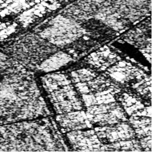
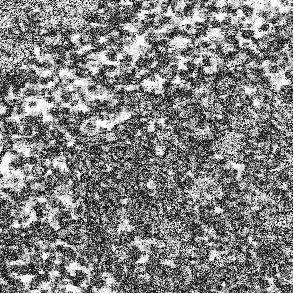

```{r setup, include=FALSE}
knitr::opts_chunk$set(echo = FALSE, cache=TRUE)
#knitr::opts_chunk$set(echo = FALSE)
library(ggplot2)
library(reshape2)
#library(plotly)
library(knitr)
library(pandoc)
library(gridExtra)
library(gtools)
library(stats4)
library(rmutil)
library(scales)
library(tidyr)
library(rmutil)
library(invgamma)
library(tidyverse)
library(RColorBrewer)
library(ggsci)
library(ggpubr)
library(patchwork)
library(dplyr)
#options(kableExtra.latex.load_packages = FALSE)
library(devtools)
#devtools::install_github("haozhu233/kableExtra")
library(kableExtra)
library(ggthemes)
library(latex2exp)
library(e1071)# kurtosis
library(viridis)
library(nortest)# AD


theme_set(theme_minimal() +
            theme(text=element_text(family="serif"),
                  legend.position = "bottom")#  top , right , bottom , or left#, panel.grid = element_blank()
)

if(!require("rstudioapi")) install("rstudioapi")
setwd(dirname(rstudioapi::getActiveDocumentContext()$path))


source("../../../Code/R/MainFunctions/gamma_sar_sample.R")
source("../../../Code/R/MainFunctions/entropy_gamma_sar.R")
source("../../../Code/R/MainFunctions/entropy_gI0.R")
source("../../../Code/R/MainFunctions/gi0_sample.R")

source("../../../Code/R/MainFunctions/van_es_estimator.R")
source("../../../Code/R/MainFunctions/correa_estimator.R")
source("../../../Code/R/MainFunctions/bootstrap_correa_estimator_log_mean.R")
source("../../../Code/R/MainFunctions/ebrahimi_estimator.R")
source("../../../Code/R/MainFunctions/noughabi_arghami_estimator.R")
source("../../../Code/R/MainFunctions/vasicek_estimator.R")
source("../../../Code/R/MainFunctions/al_omari_1_estimator.R")
source("../../../Code/R/MainFunctions/al_omari_2_estimator.R")

source("../../../Code/R/MainFunctions/bootstrap_van_es_estimator.R")
source("../../../Code/R/MainFunctions/bootstrap_correa_estimator.R")
source("../../../Code/R/MainFunctions/bootstrap_ebrahimi_estimator.R")
source("../../../Code/R/MainFunctions/bootstrap_noughabi_arghami_estimator.R")
source("../../../Code/R/MainFunctions/bootstrap_vasicek_estimator.R")
source("../../../Code/R/MainFunctions/bootstrap_al_omari_1_estimator.R")
source("../../../Code/R/MainFunctions/bootstrap_al_omari_2_estimator.R")
#The next function contains the functions: generate_samples, calculate_bias_mse, generate_plot
source("../../../Code/R/Programs/functions_sample_bias_mse.R")# read_ENVI_images
source("../../../Code/R/Programs/read_ENVI_images.R")


```


\newtheorem{lemma}{Lemma}

\newcommand{\bias}{\operatorname{Bias}}
\setlength{\tabcolsep}{4pt} 


# Introduction {#sec:Introduction}

Synthetic aperture radar (SAR) has become a fundamental technology for environmental monitoring and disaster management because of its ability to provide daytime and nighttime imagery in all weather conditions&nbsp;\cite{Mu2019}. 
However, the utility of SAR data depends on a thorough understanding of their statistical properties.
Speckle is part of SAR data because of the imaging process' coherent nature.
Its non-additivity and non-Gaussianity require statistical models that can accurately characterize them.

Among these models, the $\mathcal{G}^0$ law is a flexible and tractable model. 
Notably, this distribution encompasses the well-known Gamma distribution as the fully developed speckle case. 
<!-- The interplay between these two distributions is apparent, with the Gamma distribution representing a limiting case of the more general $\mathcal{G}^0$ model.  -->

When deciding which model is the best, practitioners face a problem.
On the one hand, if they opt for the Gamma law when the data come from the $\mathcal{G}^0$ distribution, they lose all the information about the number of scatterers, which is revealed by one of the parameters of the latter model&nbsp;\cite{Yue2021}.
On the other hand, if they apply the $\mathcal{G}^0$ distribution under fully developed speckle,
maximum likelihood estimation is tricky: 
bias increases making estimation unreliable&nbsp;\cite{VasconcellosFrerySilva:CompStat}, and
the likelihood is flat, so numerical optimization may not converge&nbsp;\cite{FreryCribariSouza:JASP:04}.
The test statistic we propose tackles this problem using the entropy as a proxy.

<!-- The entropy is a fundamental concept in information theory with broad applications to pattern recognition, statistical physics, stochastic dynamics, and statistics. -->
<!-- Shannon introduced it for a random variable in 1948&nbsp;[@Shannon1948] as a measure of information and uncertainty.  -->
<!-- In statistics, Shannon entropy is a crucial descriptive parameter, particularly for assessing data dispersion and conducting tests for normality, exponentiality, and uniformity&nbsp;[@Wieczorkowski1999]. -->

Estimating the entropy faces practical challenges, particularly when the model is unknown; non-parametric methods are utilized in such cases.
Among non-parametric approaches, Subhash et al.&nbsp;\cite{Subhash2021} discussed the use of spacing methods.
This strategy offers flexibility to address a wide range of models without imposing specific parametric constraints. 
We improve this non-parametric entropy estimator with bootstrap.

We develop a test statistic that helps discriminating between fully-developed speckle and heterogeneous clutter based a non-parametric estimator of the entropy, and we reduce its mean square error using bootstrap.
Next, we study its empirical distribution under the null hypothesis, and we conclude the study with an application to SAR data.

<!-- The article is structured as follows:  -->
<!-- Section&nbsp;\ref{sec:Background} covers statistical modeling and entropy estimation for Intensity SAR data. Section&nbsp;\ref{sec:test} outlines hypothesis testing based on non-parametric entropy.  -->
<!-- In Section&nbsp;\ref{sec:results}, we present experimental results.  -->
<!-- Finally, in Section&nbsp;\ref{sec:conclusion} conclusions are exhibited. -->


# Background {#sec:Background} 

## Statistical Modeling of Intensity SAR Data 

The primary models used for intensity SAR data include the Gamma and $\mathcal{G}_I^0$  distributions&nbsp. 
The first is suitable for fully developed speckle and is a limiting case of the second, which is appealing due to its versatility in accurately representing regions with various roughness characteristics&nbsp;\cite{Yue2021}.
We denote $Z \sim \Gamma_{\text{SAR}}(L, \mu)$ and $Z \sim \mathcal{G}_I^0(\alpha, \gamma, L)$ to indicate that $Z$ follows the distributions characterized by the respective probability density functions:
\begin{align}
	f_Z(z;L, \mu)&=\frac{L^L}{\Gamma(L)\mu^L}z^{L-1}\exp\left\{-Lz/\mu\right\} \mathbbm 1_{\mathbbm R_+}(z),\label{E:gamma1}\\
	f_Z(z; \alpha, \gamma, L)&=\frac{L^L\Gamma(L-\alpha)}{\gamma^{\alpha}\Gamma(-\alpha)\Gamma(L)}\cdot\frac{z^{L-1}}{(\gamma+Lz)^{L-\alpha}} \mathbbm 1_{\mathbbm R_+}(z),\label{E:gi01}
\end{align}
where $L \geq 1$ is the number of looks, $\Gamma(\cdot)$ is the gamma function, and $\mathbbm 1_{A}(z)$ is the indicator function of the set $A$.
In&nbsp;\eqref{E:gamma1}, $\mu > 0$ is the mean; in&nbsp;\eqref{E:gi01}  $\gamma > 0$ is the scale, $\alpha < -1$ measures the roughness,  

<!-- From&nbsp;\eqref{E:gi01}, the $r$th moment of $Z$ is expressed as: -->
<!-- \begin{align} -->
<!-- 	\mathbbm E_{\mathcal{G}_I^0}\left(Z^r\right)=\left(\frac{\gamma}{L}\right)^r\frac{\Gamma(-\alpha-r)}{\Gamma(-\alpha)}\cdot\frac{\Gamma(L+r)}{\gamma(L)}, \quad \alpha <-r.  -->
<!-- 	\label{E:rmom} -->
<!-- \end{align} -->
 
We can parametrize&nbsp;\eqref{E:gi01} by the mean value:
\begin{align*}
	\mu=\left(\frac{\gamma}{L}\right)\frac{\Gamma(-\alpha-1)}{\Gamma(-\alpha)}\cdot\frac{\Gamma(L+1)}{\gamma(L)}=-\frac{\gamma}{\alpha+1}.
\end{align*}
Thus, the probability density function that characterize the $G_I^0(\mu, \alpha, L)$ law is
\begin{multline}
		f_Z(z; \mu, \alpha, L)=\frac{L^L\Gamma(L-\alpha)}{\big(-\mu(\alpha+1)\big)^{\alpha}\Gamma(-\alpha)\Gamma(L)}\\ \frac{z^{L-1}}{\big(-\mu(\alpha+1)+Lz\big)^{L-\alpha}}.\label{E:gi02}
\end{multline}

## The Shannon Entropy

The parametric representation of Shannon entropy for a system described by a continuous random variable is:
\begin{equation}
  \label{E:entropy2}
  H(Z)=-\int_{-\infty }^\infty \ f(z)\ln f(z)\, \mathrm{d}z,
\end{equation}
here, $f(\cdot)$ is the probability density function that characterizes the distribution of the real-valued random variable $Z$.

Using&nbsp;\eqref{E:entropy2}, we can express the Shannon entropy of $\Gamma_{\text{SAR}}$ in&nbsp;\eqref{E:gamma1} and $G_I^0$ in&nbsp;\eqref{E:gi02}:
\begin{multline}
\label{E:E-gamma}
H_{\Gamma_{\text{SAR}}}(L, \mu) =   L -\ln L+\ln\Gamma(L)+(1-L)\psi^{(0)}(L) + \ln \mu, 
\end{multline}
\begin{multline}
\label{E:E-GIO}
H_{G_I^0}(\mu, \alpha, L) =L -\ln L+\ln\Gamma(L)+(1-L)\psi^{(0)}(L) +\ln \mu \\
-\ln\Gamma(L-\alpha)+ (L-\alpha) \psi^{(0)}(L-\alpha)\\
-(1-\alpha)\psi^{(0)}(-\alpha)+\ln (-1-\alpha)+\ln\Gamma(-\alpha)-L,
\end{multline}
where $\psi^{(0)}(\cdot)$ is the digamma function. 

In Fig.&nbsp;\ref{fig:Plot_GI0_to_gamma}, we depict the behavior of the entropy of \(G_I^0\) when \(\alpha \in \left\{-\infty, -20, -8, -3\right\}\), observing its convergence towards the entropy of \(\Gamma_{\text{SAR}}\) as \(\alpha\) takes large negative values. 


```{r Plot_GI0_to_gamma, echo=FALSE, message=FALSE, warning=FALSE, out.width="100%", fig.show="hold", fig.align="center", fig.pos="hbt", fig.cap="$H_{ G_I^0}$ converges to the $H_{\\Gamma_{\\text{SAR}}}$ as $\\alpha$ takes large negative values and $L=8$."}


L <- c(8)
alphas <- c(  -3, -8, -20, -1000)
alpha_labels <- c( expression(italic(alpha) == -3), expression(italic(alpha) == -8), expression(italic(alpha) == -20), expression(italic(alpha) == -1000))

mu <- seq(0.1, 10, length.out = 500)

# Entropy GI0

muEntropy <- data.frame()

for (alpha in alphas) {
  entropies_GI0 <- sapply(L, function(L) entropy_gI0(mu, alpha, L))
  muEntropy <- rbind(muEntropy, data.frame(mu = mu, Entropy = entropies_GI0, alpha = as.factor(alpha)))
}

muEntropy.molten <- melt(muEntropy, id.vars = c("mu", "alpha"),  value.name = "Entropy")

# Entropy Gamma SAR

entropies_gamma <- sapply(L, function(L) entropy_gamma_sar(L, mu))

Entropy_gamma <- data.frame(mu, entropies_gamma)

Entropy_gamma.molten <- melt(Entropy_gamma, id.vars = "mu", value.name = "Entropy Gamma")

#plot

ggplot(muEntropy.molten, aes(x = mu, y = Entropy, col = alpha)) +
  geom_line(data = Entropy_gamma.molten, aes(x = mu, y = `Entropy Gamma`), color = "blue", linetype = "solid",linewidth = 1.5) + 
  geom_line(linetype = "longdash",  linewidth = 2, alpha=.7) +
  annotate("text", x = max(mu)+0.2, y = max(Entropy_gamma.molten$`Entropy Gamma`), 
           label = TeX("$\\Gamma_{\\tiny{SAR}}$"), vjust = 0.9, hjust = 0.1, color = "blue")+
  theme_minimal() +
  scale_color_manual(values = brewer.pal(7, "Dark2")[1:5], labels = alpha_labels) +
  #scale_color_manual(values = pal_jama()(7)[2:5], labels = alpha_labels) +
  #scale_color_manual(values = 	pal_cosmic()(7)[1:5], labels = alpha_labels) +
  labs(col = "Roughness", linetype = NULL) +
  xlab(expression(paste(mu))) +
  ylab("Entropy") +  
  theme(text = element_text(family = "serif"),
        legend.position = "bottom")


```


## Estimation of the Shannon Entropy

One of the earliest non-parametric estimators relying on spacings was introduced by Vasicek&nbsp;\cite{vasicek1976test}. 
Assuming that $\bm{Z}=(Z_1, Z_2,\ldots,Z_n)$ is a random sample from the distribution $F(z)$, the estimator is defined as:
\begin{equation*}
\label{E:Vas}
	\widehat{H}_{\text{V}}(\bm{Z})=\frac{1}{n}\sum_{i=1}^{n}\ln\left[\frac{n}{2m}\left(Z_{(i+m)}-Z_{(i-m)}\right)\right],
	\end{equation*}
where $m<n/2$ is a positive integer, $Z_{(i+m)}-Z_{(i-m)}$ is the $m$-spacing and $Z_{(1)}\leq Z_{(2)}\leq\ldots\leq Z_{(n)}$ are the order statistics and $Z_{(i)}= Z_{(1)}$ if $i<1$, $Z_{(i)}= Z_{(n)}$ if $i>n$.

Several authors have explored adaptations to Vasicek's estimator. 
We consider three estimators known for their superior performance&nbsp;\cite{Cassetti2022}:

* Correa&nbsp;\cite{correa1995new}: $\widehat{H}_{\text{C}}$.

* Ebrahimi et al&nbsp;\cite{Ebrahimi1994}: $\widehat{H}_{\mathrm{E}}$.

* Al Omary&nbsp;\cite{IbrahimAlOmari2014}: $\widehat{H}_{\mathrm{AO}}$.


## Enhanced Bootstrap Technique

We employ the bootstrap technique to refine the precision of existing non-parametric entropy estimators. 
<!-- This approach involves generating new datasets through resampling with repetition from an existing one. -->

Let's assume that non-parametric entropy estimators \(\widehat{H}=\widehat{\theta}(\bm{Z})\) are inherently biased, that is:
\begin{equation}
\label{Eq:bias1}
\bias\big(\widehat{\theta}(\bm{Z})\big) = E\big[\widehat{\theta}(\bm{Z})\big] - \theta \neq 0.
\end{equation}
Our bootstrap-improved estimators are of the form:
<!-- introducing an "ideal unbiased estimator" \(\check{\theta}(\bm{Z})\): -->
<!-- \begin{equation} -->
<!-- \label{Eq:bias2} -->
<!-- \widecheck{\theta}(\bm{Z}) = \widehat{\theta}(\bm{Z}) - \bias\big(\widehat{\theta}(\bm{Z})\big). -->
<!-- \end{equation} -->
<!-- However, \(\check{\theta}(\bm{Z})\) is not an estimator, because it depends on the true parameter \(\theta\), prompting the formulation of a new estimator \(\widetilde{H}\).  -->
<!-- From&nbsp;\eqref{Eq:bias1} and&nbsp;\eqref{Eq:bias2} we have: -->
\begin{align*}
\widetilde{H} &= 2\widehat{\theta}(\bm{Z}) - \frac{1}{B}\sum_{b=1}^B \widehat{\theta}_b(\bm{Z}^{(b)}),
\end{align*}
where $B$ is the number of replications in the bootstrap technique.
Applying this methodology, the original estimators by Correa, Ebrahimi, and Al-Omari are now denoted as the proposed bootstrap-enhanced versions: $\widetilde{H}_{\text{C}}$, $\widetilde{H}_{\text{E}}$, and $\widetilde{H}_{\text{AO}}$, respectively.


Simulations are conducted using $G_I^0$ distribution, with $500$ simulated samples of size \(n\in\left\{9, 25, 49, 81, 121\right\}\). For brevity, we present the results with \(\mu=1\), \(\alpha=-10\), and \(L=5\). The results are consistent for other values of the mean. 
In the case of the bootstrap technique, each sample is replicated $100$ times with replacement.
We choose to use the following heuristic formula for spacing, $m=\left[\sqrt{n}+0.5\right]$.


In Fig.&nbsp;\ref{fig:Plot_bias_mse_gi0} we depict comparisons of bias and mean squared error (MSE) between the original non-parametric entropy estimators and their respective bootstrap-enhanced versions. 
The use of the bootstrap technique exhibits more precision, reduced bias and MSE, and improved convergence.
<!-- ACF Show only the first line, i.e., for mu=1, and state that the results are consistent for other values of the mean -->

The results of simulation are exhibited in Table&nbsp;\ref{tab:table2}.
The precision of estimators, as evidenced by bias and MSE comparisons, benefits significantly from the bootstrap technique, particularly for sample sizes below 81.

```{r Simulated_data_gi0, echo=FALSE, message=FALSE}

set.seed(1234567890, kind = "Mersenne-Twister")
sample_sizes <- c(9, 25, 49, 81, 121 )

# Number of replications
R <-500

# Number of bootstrap replications
B1 <- 100
mu_values <- c(1)
alpha <- -10
L <- 5

estimators <- list(
  "Correa" = correa_estimator,
  "Ebrahimi" = ebrahimi_estimator,
  "Al Omari" = al_omari_1_estimator,
  "Correa Bootstrap" = bootstrap_correa_estimator,
  "Ebrahimi Bootstrap" = bootstrap_ebrahimi_estimator,
  "Al Omari Bootstrap" = bootstrap_al_omari_1_estimator
)


calculate_results_gi0 <- function(sample_sizes, R, B1, mu_values, alpha, L, estimators) {
  results_list <- list()

  for (mu_val in mu_values) {
    
    results <- calculate_bias_mse_gi0(sample_sizes, R, B1, mu_val, alpha, L, estimators)
    df <- as.data.frame(results)

    
    results_list[[as.character(mu_val)]] <- df
  }

  return(results_list)
}


results_gi0 <- calculate_results_gi0(sample_sizes, R, B1, mu_values, alpha, L, estimators)


save(results_gi0, file = "./Data/results_gi0.Rdata")


```


```{r Plot_bias_mse_gi0, echo=FALSE, message=FALSE, warning=FALSE, out.width="100%", fig.show="hold", fig.align="center",  fig.cap="Bias and MSE of entropy estimators for  $G_I^0$, $L=5$, $\\alpha=-10$.", fig.width=6, fig.height=3.0}


load("./Data/results_gi0.Rdata")


estimators_to_plot <- c("Correa", "Ebrahimi", "Al Omari",  "Correa Bootstrap", "Ebrahimi Bootstrap", "Al Omari Bootstrap" )
  latex_estimator_names <- c("Correa" = expression("$\\widehat{italic(H)}_{C}$"),
                             "Correa Bootstrap" = expression("$\\widetilde{italic(H)}_{C}$"),
                            "Ebrahimi" = expression("$\\widehat{italic(H)}_{E}$"),
                            "Al Omari" = expression("$\\widehat{italic(H)}_{AO}$"),
                            "Ebrahimi Bootstrap" = expression("$\\widetilde{italic(H)}_{E}$"),
                            "Al Omari Bootstrap" = expression("$\\widetilde{italic(H)}_{AO}$"))
selected_estimators_latex <- latex_estimator_names[estimators_to_plot]


combined_plot_gi0 <- generate_plot_gi0_esp(results_gi0, mu_values, selected_estimators_latex, ncol = 1, nrow = 1)


print(combined_plot_gi0)


```


```{r Table_gi0, echo=FALSE, message=FALSE, warning=FALSE, results='asis'}
load("./Data/results_gi0.Rdata")

# Define estimators
estimators_to_table <- c("Correa Bootstrap", "Ebrahimi Bootstrap", "Al Omari Bootstrap")

# Filter and reshape data
filtered_results <- purrr::map_dfr(results_gi0, ~ .x %>% filter(Estimator %in% estimators_to_table), .id = "mu")

reshaped_results <- filtered_results %>%
  pivot_wider(names_from = Estimator, values_from = c(Bias, MSE))

colnames(reshaped_results) <- c("$\\mu$", "$n$", "$\\widetilde{H}_{\\text{C}}$", "$\\widetilde{H}_{\\text{E}}$", "$\\widetilde{H}_{\\text{AO}}$", "$\\widetilde{H}_{\\text{C}}$", "$\\widetilde{H}_{\\text{E}}$", "$\\widetilde{H}_{\\text{AO}}$")


reshaped_results[] <- lapply(reshaped_results, function(x) {
  if (is.numeric(x)) {
    if (all(x %% 1 == 0)) {
      formatted_numbers <- sprintf("$%d$", x)
    } else {
      formatted_numbers <- ifelse(x < 0, sprintf("$%.3f$", x), sprintf("$\\phantom{-}%.3f$", x))
    }
    return(formatted_numbers)
  } else {
    return(x)
  }
})


print(
  kbl(
    reshaped_results,
    caption = "Bias and MSE of bootstrap estimators for $G_I^0$, $L=5$, $\\alpha=-10$.",
    format = "latex",
    booktabs = TRUE,
    align = "lrrrrrrrr",
    escape = FALSE, 
    digits = 3,  
    label = "table2"
  ) %>%
    add_header_above(c(" ", " ", "Bias" = 3, "MSE" = 3)) %>%
    collapse_rows(columns = 1:2, latex_hline = "major", valign = "middle") %>%
    row_spec(0,  align = "c")
    #kable_styling(latex_options = "hold_position", "scale_down")
  )

```

# Hypothesis testing based on non-parametric entropy {#sec:test}

General asymptotic results for functions of spacings are detailed in Ref.&nbsp;\cite{Khashimov1990}, while Van Es&nbsp;\cite{Bert1992} developed a correction for the case of Shannon entropy.
Following the work of these authors, the next result applies: 
\begin{lemma}
Suppose that $f(\cdot)$ is a bounded density bounded away from zero and satisfies a Lipschitz condition on its support.
Then, if $m,n\rightarrow \infty$ and $m=o(n^{1/2})$, holds that:
\begin{equation*}
\sqrt{n}\,\Big(\label{Eq:bias_t}
\widetilde{H}_{i}+\int_{-\infty}^\infty f(z)\ln f(z) \mathrm{d}z\Big)
\xrightarrow[]{\mathcal{D}}
\mathcal{N}\big(0,\operatorname{Var}(\ln f(Z))\big).
\end{equation*}
\end{lemma} 
Consider, starting from the previous lemma, we aim at testing the following hypotheses: 

$$
 \begin{cases}\mathcal{H}_0: \widetilde{H}(\bm{Z})-H_{\Gamma_{\text{SAR}}}(\bm{Z})=0 \\ 
  \mathcal{H}_1:\widetilde{H}(\bm{Z})-H_{\Gamma_{\text{SAR}}}(\bm{Z})\neq0 .\end{cases}
$$
In other words, we verify the hypothesis that the data are fully-developed speckle with the following test statistic:
\begin{equation}
\label{Eq:test_e}
S(\bm{Z};L_0)= \widetilde{H}_{\text{C}}(\bm{Z})-\left[H_{\Gamma_{\text{SAR}}}(L_0)+\ln \widebar{\bm{Z}}\right].
\end{equation}
<!-- This test statistic assess the behavior of the data under the null hypothesis, through the empirical distribution.  -->
The values should be around zero under the null hypothesis and far otherwise. 
<!-- This suggests significant differences and implies the presence of heterogeneous clutter. -->

# Results {#sec:results} 


## The Proposed Test
Fig.&nbsp;\ref{fig:Plot_density} depicts empirical test statistic densities for various sample sizes, and Table&nbsp;\ref{tab:table_stat_combined} summarizes key statistics, including mean, SD, variance (Var), coefficient of variation (CV), skewness, kurtosis, and Anderson–Darling $p$-values for normality. 
<!-- ACF Only show L=2 and L=8 -->
Results with $p$-values $> 0.05$  indicate no evidence against normality. 
Small variance and near-zero skewness and kurtosis suggest limited spread, symmetry, and light tails. 
The coefficient of variation shows that as the sample size increases, variability with respect to the mean decreases.
Normal QQ-plots, omitted for brevity, confirm that there is no evidence to reject the normal distribution.

<!-- In Fig.&nbsp;\ref{fig:Plot_normality_qq}, normal QQ-plots visually affirm distributional similarity with the expected normal line. -->

```{r Simulated_density, echo=FALSE, message=FALSE}
#, cache = TRUE, autodep = TRUE
set.seed(1234567890, kind = "Mersenne-Twister")

R <- 800
mu <- 1
B <- 5

sample.size <- c(25,50, 100, 200, 300)
L_values <- c(2,  8)

all_summary_stats <- list()
all_TestStatistics <- list()


# For each L
for (L in L_values) {
  TestStatistics1 <- list()  
  summary_stats <- data.frame( LValue = character(),
                              SampleSize = numeric(),
                              Mean = numeric(),
                              SD = numeric(),
                              Variance = numeric(),
                              CV= numeric(),
                              Skewness = numeric(),
                              Kurtosis = numeric(),
                              adpvalue = numeric()
                              )  
 
  
  for (s in sample.size) {
    TestStat1 <- numeric(R)
    
    for (r in 1:R) {
      z <- gamma_sar_sample(L, mu, s)
      #z <- gi0_sample(mu, alpha1, L, s)
      TestStat1[r] <- bootstrap_correa_estimator_log_mean(z, B) + (-L + log(L) - lgamma(L) - (1 - L) * digamma(L))
    }
    
    TestStatistics1[[as.character(s)]] <- data.frame("SampleSize" = rep(s, R), "Test_Statistics" = TestStat1)
    

    
   
    mean_val <- mean(TestStat1)
    sd_val <- sd(TestStat1)
    var_val <- var(TestStat1)
    skewness_val <- skewness(TestStat1)
    kurtosis_val <- kurtosis(TestStat1)
   # lillie_p_value <- lillie.test(TestStatistics1[[as.character(s)]]$Test_Statistics)$p.value
    ad_p_value <- ad.test(TestStatistics1[[as.character(s)]]$Test_Statistics)$p.value
    cv_val <- abs(sd_val / mean_val)
    
    summary_stats <- rbind(summary_stats, data.frame(LValue = as.character(L),
                                                     SampleSize = s,
                                                     Mean = mean_val,
                                                     SD = sd_val,
                                                     Variance = var_val,
                                                      CV = cv_val,
                                                     Skewness = skewness_val,
                                                     Kurtosis = kurtosis_val,
                                                     adpvalue = ad_p_value
                                                     )) 
  
  }
  
  all_TestStatistics[[as.character(L)]] <- TestStatistics1
  all_summary_stats[[as.character(L)]] <- summary_stats
  
  

  save(all_TestStatistics, all_summary_stats, file = paste0("./Data/results_", L, ".Rdata"))
}


```

```{r Plot_density, echo=FALSE, message=FALSE, warning=FALSE, out.width="100%", fig.show="hold", fig.align="center",  fig.cap="Empirical density  under null hypothesis.", fig.width=6, fig.height=5}

theme_set(theme_minimal() +
            theme(text = element_text(family = "serif"),
                  legend.position = "bottom",
                  legend.text = element_text(angle = 0, vjust = 0.5)))

all_plots <- list()

for (L in L_values) {
  load(paste0("./Data/results_", L, ".Rdata"))

  combined_data <- do.call(rbind, all_TestStatistics[[as.character(L)]])
  combined_data$L <- L

  p <- ggplot(combined_data, aes(x = Test_Statistics, col = factor(SampleSize), linetype = factor(SampleSize))) +
    geom_line(stat = "density", linewidth = 1.0) +
    scale_color_viridis(discrete = TRUE, option = "C", direction = -1, begin = 0.1, end = 0.8, name = "Sample Size") +
    scale_linetype_manual(values = rep("solid", length(sample.size)), name = "Sample Size") +
    labs(x = "Test Statistics", y = "Density") +
    ggtitle(bquote(italic(L) == .(L))) +
    theme(plot.title = element_text(hjust = 0.5))#titulo centrado

  if (!any(L == L_values)) {
    p = p
  }

  all_plots[[as.character(L)]] <- p
}

combined_plot <- wrap_plots(all_plots, ncol = 2, nrow = 2) +
  plot_layout(guides = "collect")

print(combined_plot)


```


```{r Table_statistic, echo=FALSE, message=FALSE, warning=FALSE, results='asis'}

cat("\\setlength{\\tabcolsep}{1.0pt}\n")

load("./Data/results_2.Rdata")
summary_stats_2 <- all_summary_stats[["2"]]


# load("./Data/results_5.Rdata")
# summary_stats_5 <- all_summary_stats[["5"]]


load("./Data/results_8.Rdata")
summary_stats_8 <- all_summary_stats[["8"]]


combined_summary_stats <- rbind(
  transform(summary_stats_2),
  #transform(summary_stats_5),
  transform(summary_stats_8)
  
)
colnames(combined_summary_stats) <- c("$L$", "$n$", "Mean", "SD", "Var", "CV", "Skewness", "Kurtosis", "$p$-value")


# LaTeX notation 
combined_summary_stats[] <- lapply(combined_summary_stats, function(x) {
  if (is.numeric(x)) {
    if (all(x %% 1 == 0)) {
      formatted_numbers <- sprintf("$%d$", x)
    } else {
      formatted_numbers <- ifelse(x < 0, sprintf("$%.4f$", x), sprintf("$\\phantom{-}%.4f$", x))
    }
    return(formatted_numbers)
  } else {
    return(x)
  }
})


table_result_combined <- kbl(
  combined_summary_stats,
  caption = "Descriptive analysis of $S(\\bm Z; L)$ with $L\\in\\left\\{2, 8\\right\\}$ and $\\mu=1$.",
  format = "latex",
  booktabs = TRUE,
  align = "lrrrrrrr",
  escape = FALSE,
  digits = 4,
  label = "table_stat_combined"
  #table.env = 'table*' # to span multiple columns
) %>%
  collapse_rows(latex_hline = "major", valign = "middle") %>%
  row_spec(0,  align = "c")
  

print(table_result_combined)


```

```{r Plot_normality_qq, echo=FALSE, message=FALSE, warning=FALSE, out.width="100%", fig.show="hold", fig.align="center",  fig.cap="Normal QQ-plots for  $n=100$.", fig.width=6, fig.height=5, eval=FALSE}


theme_set(theme_minimal() +
            theme(text = element_text(family = "serif"),
                  legend.position = "bottom",
                  legend.text = element_text(angle = 0, vjust = 0.5)))


# Load saved results
load("./Data/results_2.Rdata")
load("./Data/results_5.Rdata")
load("./Data/results_8.Rdata")
load("./Data/results_18.Rdata")

# Specific sample size
selected_sample_size <- 100

# 
ggplot_list <- list()

#  L
for (L in c(2, 5, 8, 18)) {
  TestStatistics1 <- all_TestStatistics[[as.character(L)]]
  
  # 
  if (as.character(selected_sample_size) %in% names(TestStatistics1)) {
    p <- ggplot(TestStatistics1[[as.character(selected_sample_size)]], 
                aes(sample = Test_Statistics)) +
      geom_qq(col = "blue", shape = 20) +
      geom_qq_line(col = "darkgreen", linetype = 2) +
      labs(title = bquote(italic(L) == .(L)),
           x = "Theoretical Quantiles",
           y = "Sample Quantiles") +
      theme(plot.title = element_text(hjust = 0.5))#titulo centrado

    
    ggplot_list[[as.character(L)]] <- p
  } else {
    warning(paste("No size sample", selected_sample_size, " L =", L))
  }
}
combined_plot1 <- wrap_plots(ggplot_list, ncol = 2, nrow = 2) +
  plot_layout(guides = "collect")

print(combined_plot1)


# }


```

After verifying the normality of the data, we proceeded to explore the capabilities of the proposed test in terms of size and power.
Under $\mathcal{H}_0$ the test statistic  is asymptotically distributed as $\mathcal{N}(0,\sigma_S^2)$, and therefore, the $p$-value of the observed test statistic is $2\Phi(\varepsilon)-1$, where $\Phi$ is the standard Gaussian cumulative distribution function and 
$$
\varepsilon=\frac{\tilde{H}(\bm{Z})-H_{\Gamma_{\text{SAR}}}(\bm{Z})}{\sigma_S}.
$$
We considered nominal levels of \SI{1}{\percent}, \SI{5}{\percent}, and \SI{10}{\percent}. 
In reference to the size, $1000$ simulations have been used for various sample sizes with  satisfactory results. In all cases, the nominal level has been achieved. 
The power, in general, improves with the increase in the sample size and the number of looks. 
The results are presented in Table&nbsp;\ref{tab:table_size_power}.

```{r Simulated_error_type_I, echo=FALSE, message=FALSE}
set.seed(1234567890, kind = "Mersenne-Twister")


# 
calculate_p_value <- function(test_statistic, mu_W, sigma_W, alpha_nominal) {
  epsilon <- test_statistic / sigma_W
  p_value <- 2*pnorm(abs(epsilon))-1
  
  return(p_value < alpha_nominal)  
}

R <- 1000
mu <- 1
B <- 2
L_values <- c( 5, 8)
sample_sizes <- c( 25, 50, 100, 200, 300)
alpha_nominals <- c(0.01, 0.05, 0.1)

results <- data.frame()

for (L in L_values) {
  for (alpha_nominal in alpha_nominals) {
    TestStatistics <- NULL
    mean_entropy <- numeric(length(sample_sizes))
    sd_entropy <- numeric(length(sample_sizes))
    
    for (s in sample_sizes) {
      TestStat <- numeric(R)
      
      for (r in 1:R) {
        z <- gamma_sar_sample(L, mu, s)
        TestStat[r] <- bootstrap_correa_estimator_log_mean(z, B) - (L - log(L) + lgamma(L) + (1 - L) * digamma(L))
      }
      mean_entropy[sample_sizes == s] <- mean(TestStat)
      sd_entropy[sample_sizes == s] <- sd(TestStat)
      
      TestStatistics <- rbind(TestStatistics, data.frame("L" = rep(L, R), "Sample_Size" = rep(s, R), "Test_Statistics" = TestStat))
    }
    
    mu_W <- mean_entropy
    sigma_W <- sqrt(sd_entropy^2)
    
    p_values <- apply(TestStatistics, 1, function(row) {
      calculate_p_value(row["Test_Statistics"], mu_W[sample_sizes == row["Sample_Size"]], sigma_W[sample_sizes == row["Sample_Size"]], alpha_nominal)
    })
    
    result <- data.frame("L" = TestStatistics$L, "Sample_Size" = TestStatistics$Sample_Size, "Alpha_Nominal" = alpha_nominal, "P_Value" = p_values)
    results <- rbind(results, result)
  }
}


save(results, file = "./Data/type_I_results.Rdata")

```

```{r Simulated_power, echo=FALSE, message=FALSE}

set.seed(1234567890, kind = "Mersenne-Twister")


calculate_p_value <- function(test_statistic, mu_W, sigma_W) {
  epsilon <- test_statistic  / sigma_W
  p_value <- 2 * (1 - pnorm(abs(epsilon)))
  
  return(p_value)
}


calculate_type_II_error_rate <- function(p_values, alpha_nominal) {
  type_II_error_rate <- sum(p_values >= alpha_nominal) / length(p_values)
  return(type_II_error_rate)
}

# Function to calculate power for different L values and alpha_nominals
calculate_power <- function(R, mu, L_values, B, sample_sizes, alpha_nominals) {
  results <- data.frame()
  
  for (L in L_values) {
    for (alpha_nominal in alpha_nominals) {
      TestStatistics <- list()
      mean_entropy <- numeric(length(sample_sizes))
      sd_entropy <- numeric(length(sample_sizes))
      
      for (s in sample_sizes) {
        TestStat <- numeric(R)
        
        for (r in 1:R) {
          z <- gi0_sample(mu, -5, L, s)
          TestStat[r] <- bootstrap_correa_estimator_log_mean(z, B) - (L - log(L) + lgamma(L) + (1 - L) * digamma(L))
        }
        
        mean_entropy[sample_sizes == s] <- mean(TestStat)
        sd_entropy[sample_sizes == s] <- sd(TestStat)
        
        TestStatistics[[as.character(s)]] <- TestStat
      }
      
      mu_W <-  mean_entropy  
      sigma_W <- sqrt(sd_entropy^2)  
      
      p_values <- lapply(TestStatistics, function(TestStat) {
        apply(data.frame("Test_Statistics" = TestStat), 1, function(row) {
          calculate_p_value(row["Test_Statistics"], mu_W, sigma_W[as.numeric(names(TestStatistics)) == as.numeric(s)])
        })
      })
      
      type_II_error_rates <- sapply(p_values, function(p_values_for_size) {
        calculate_type_II_error_rate(p_values_for_size, alpha_nominal)
      })
      
      power <- 1 - type_II_error_rates
      
      result_row <- data.frame(
        L = L,
        alpha_nominal = alpha_nominal,
        Sample_Size = sample_sizes,
        power = power
      )
      
      results <- rbind(results, result_row)
    }
  }
  
  return(results)
}


R <- 1000
mu <- 1
L_values <- c(5,  8)
B <- 1
sample_sizes <- c(25, 50, 100, 200, 300)
alpha_nominals <- c(0.01, 0.05, 0.1)

results_power <- calculate_power(R, mu, L_values, B, sample_sizes, alpha_nominals)
save(results_power, file = "./Data/results_power.Rdata")

```

```{r Table_size_and_power, echo=FALSE, message=FALSE, warning=FALSE, results='asis'}
cat("\\setlength{\\tabcolsep}{4pt}\n")

load("./Data/type_I_results.Rdata")


type_I_error_rates <- tapply(results$P_Value, INDEX = list(results$L, results$Sample_Size, results$Alpha_Nominal), FUN = function(p_values) {
  sum(p_values) / length(p_values)  
})


type_I_error_results <- as.data.frame(as.table(type_I_error_rates))

colnames(type_I_error_results) <- c("L", "Sample_Size", "Alpha_Nominal", "Type_I_Error_Rate")

spread_results <- spread(type_I_error_results, key = Alpha_Nominal, value = Type_I_Error_Rate)


spread_results <- spread_results %>% 
  select(L, Sample_Size, `0.01`, `0.05`, `0.1`)

load("./Data/results_power.Rdata")


summary_stats <- results_power %>%
  spread(key = alpha_nominal, value = power) %>%
  select(L, Sample_Size, `0.01`, `0.05`, `0.1`)


combined_results <- merge(spread_results, summary_stats, by = c("L", "Sample_Size"))
combined_results <- combined_results %>% 
  arrange(L, Sample_Size)

combined_results <- combined_results %>% 
  select(L, Sample_Size, `0.01.x`, `0.05.x`, `0.1.x`, `0.01.y`, `0.05.y`, `0.1.y`)


colnames(combined_results) <- c("$L$", "$n$", "$1\\%$", "$5\\%$", "$10\\%$", "$1\\%$", "$5\\%$", "$10\\%$")

# LaTeX notation 
combined_results[] <- lapply(combined_results, function(x) {
  if (is.numeric(x)) {
    if (all(x %% 1 == 0)) {
      formatted_numbers <- sprintf("$%d$", x)
    } else {
      formatted_numbers <- ifelse(x < 0, sprintf("$%.3f$", x), sprintf("$\\phantom{-}%.3f$", x))
    }
    return(formatted_numbers)
  } else {
    return(x)
  }
})


table_combined_result <- kbl(
  combined_results,
  caption = "Size and Power of the proposed test.",
  format = "latex",
  booktabs = TRUE,
  align = "lcccccccc",
  escape = FALSE,
  digits = 3,
  label = "table_size_power"
)%>%
  add_header_above(c(" ", " ", "Size" = 3,  "Power" = 3)) %>%
  collapse_rows(columns = 1:2, latex_hline = "major", valign = "middle") %>%
  row_spec(0,  align = "c")

print(table_combined_result)


```

Fig.&nbsp;\ref{fig:Plot_empirical_test} shows the test statistic&nbsp;\eqref{Eq:test_e} empirical distribution. 
Under the null hypothesis, the density centers around zero. 


```{r Sim_empirical_test, echo=FALSE, message=FALSE}

set.seed(1234567890, kind = "Mersenne-Twister")

R <- 2000
mu <- 1
L <- 8
B <- 1
sample.size <- c( 81)

alpha1_values <- c( -5)

TestStatistics1 <- NULL
TestStatistics2 <- NULL

for (alpha_val in alpha1_values) {

  alpha1 <- alpha_val
  
  mean_entropy1 <- numeric(length(sample.size))
  mean_entropy2 <- numeric(length(sample.size))
  
  for (s in sample.size) {
    TestStat1 <- numeric(R)
    TestStat2 <- numeric(R)
    
    for (r in 1:R) {
      
      z <- gamma_sar_sample(L, mu, s)
      TestStat1[r] <- bootstrap_correa_estimator_log_mean(z, B) - (L - log(L) + lgamma(L) + (1 - L) * digamma(L))
      z1 <- gi0_sample(mu, alpha1, L, s)
      TestStat2[r] <- bootstrap_correa_estimator_log_mean(z1, B) - (L - log(L) + lgamma(L) + (1 - L) * digamma(L))
        
      
    }
    
    TestStatistics1 <- rbind(TestStatistics1, data.frame("Sample_Size" = rep(s, R), "Test_Statistics" = TestStat1))
    TestStatistics2 <- rbind(TestStatistics2, data.frame("Sample_Size2" = rep(s, R), "Test_Statistics2" = TestStat2))
  }
}

# 
save(TestStatistics1, TestStatistics2, file = "./Data/sim_empirical_test.Rdata")


```

```{r Plot_empirical_test, echo=FALSE, message=FALSE, warning=FALSE, out.width="90%", fig.show="hold", fig.align="center", fig.pos="hbt", fig.cap="Empirical distributions under the null (centered around zero) and alternative hypotheses (e.g., $\\alpha=-5$, showing a shift from zero), with $\\mu=1$ and $L=8$."}

# 
load("./Data/sim_empirical_test.Rdata")

  difference.betweeen.GammaSAR.GI0.n.Look <- function(alpha, L) {
    return(
      -L - lgamma(L-alpha) + 
        (L-alpha)*(digamma(L - alpha))- 
        (1-alpha)*digamma(- alpha)+
        log(-1 - alpha)+
        lgamma(-alpha)
    )
  }


plots_list <- list()

for (alpha_val in alpha1_values) {
  plot <- ggplot(TestStatistics1, aes(x = Test_Statistics)) +
    geom_line(aes(col = factor(Sample_Size), linetype = factor(Sample_Size)), stat = "density", linewidth = 1.0) +
    geom_line(data = TestStatistics2, aes(x = Test_Statistics2), stat = "density", color = "blue", linetype = "dashed", linewidth = 1) +
    geom_vline(xintercept = difference.betweeen.GammaSAR.GI0.n.Look(-5, 8), col="darkgreen", linetype = "dotted", linewidth = 0.6) +
    annotate("text", x=difference.betweeen.GammaSAR.GI0.n.Look(-5, 8), y=5, parse=TRUE, label="alpha==-5", hjust=-.1, vjust=1.0, col="darkgreen") +
    geom_vline(xintercept = difference.betweeen.GammaSAR.GI0.n.Look(-1000, 8), col="darkgreen", linetype = "dotted", linewidth = 0.6) +
    theme_minimal() +
    theme(
      text = element_text(family = "serif"),
      legend.position = "none"  
    )+
    labs(x = "Test Statistics", y = "Density")
  
  plots_list[[as.character(alpha_val)]] <- plot
}

grid.arrange(grobs = plots_list, ncol = 1)

```

## Application to Actual Data

We applied the test statistical to a SAR image of Flevoland, Netherlands, acquired by the Sentinel-1A system operating in the C band, with  HH polarization, intensity format, and $L=5$ nominal looks.
This image has $300 \times 300$ pixels and covers urban areas and agricultural fields. 
<!-- The metadata associated with these original SAR images includes a number of looks $L = 5$. -->

Fig.&nbsp;\ref{fig:Real_SAR_Images}(a) shows the SAR image.
We used $7 \times 7$ local sliding windows to compute the test, and Fig.&nbsp;\ref{fig:Real_SAR_Images}(b) shows the $p$-values.
The new image reveals two distinct regions: lighter background indicates homogeneity, while darker backgrounds represent heterogeneous areas.

```{r Real_SAR_Images, echo=FALSE, message=FALSE, warning=FALSE, out.width="100%", fig.show="hold", fig.align="center",fig.pos = 'H', fig.cap='Results of applying the test statistical to actual data.', fig.subcap=c('SAR image.', '$p$-values.' ), out.width='.48\\linewidth',  fig.ncol=2}



```


# Conclusion {#sec:conclusion} 

We propose a testing procedure for distinguishing between fully-developed speckle and heterogeneous clutter with a test statistic based on a bootstrap-improved estimator of the Shannon entropy. 
<!-- The Correa estimator ($\widetilde{H}_{\text{C}}$) stands out as the optimal choice, exhibiting superior performance in bias and MSE across simulations involving the $G_I^0$ distribution.  -->
<!-- This superiority becomes particularly pronounced when the number of looks exceeds $2$. -->
Our proposal includes the empirical size and power considering various sample sizes, numbers of looks, and nominal levels. 

The results show that the test performs acceptably with sample sizes larger than $50$. 
However, practical scenarios often involve smaller sample sizes, typically obtained over windows of size $7 \times 7$.

The application of the test to actual SAR data yielded promising outcomes, effectively discerning distinct regions in the image and showing its potential for discriminating between homogeneous and heterogeneous zones.

# Acknowledgement {-}

This study was financed in part by the Coordenação de Aperfeiçoamento de Pessoal de Nível Superior  (CAPES) and the Fundação de Amparo à Ciência e Tecnologia de Pernambuco (FACEPE), Brazil.

# References {#references .numbered}


