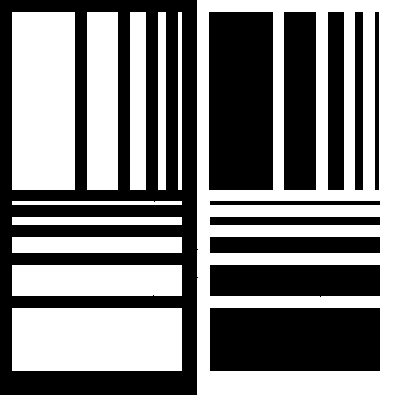

```{r setup, include=FALSE}
knitr::opts_chunk$set(echo = FALSE, cache=TRUE)
# knitr::opts_chunk$set(echo = FALSE,cache=TRUE,
#                       message=FALSE, warning=FALSE,
#                       fig.path='figs/',
#                       cache.path = '_cache/',
#                       fig.process = function(x) {
#                       x2 = sub('-\\d+([.][a-z]+)$', '\\1', x)
#                       if (file.rename(x, x2)) x2 else x
#                       })

library(ggplot2)
library(reshape2)
#library(plotly)
library(knitr)
library(pandoc)
library(gridExtra)
library(gtools)
library(stats4)
library(rmutil)
library(scales)
library(tidyr)
library(rmutil)
library(invgamma)
library(tidyverse)
library(RColorBrewer)
library(ggsci)
library(ggpubr)
library(patchwork)
library(dplyr)
#options(kableExtra.latex.load_packages = FALSE)
#library(devtools)
#devtools::install_github("haozhu233/kableExtra")
library(kableExtra)
library(ggthemes)
library(latex2exp)
library(e1071)# kurtosis
library(viridis)
library(nortest)# AD


theme_set(theme_minimal() +
            theme(text=element_text(family="serif"),
                  legend.position = "bottom")#  top , right , bottom , or left#, panel.grid = element_blank()
)

# if(!require("rstudioapi")) install("rstudioapi")
# setwd(dirname(rstudioapi::getActiveDocumentContext()$path))


source("../../../Code/R/MainFunctions/gamma_sar_sample.R")
source("../../../Code/R/MainFunctions/entropy_gamma_sar.R")
source("../../../Code/R/MainFunctions/entropy_renyi_gamma_sar.R")
source("../../../Code/R/MainFunctions/entropy_gI0.R")
source("../../../Code/R/MainFunctions/gi0_sample.R")

source("../../../Code/R/MainFunctions/van_es_estimator.R")
source("../../../Code/R/MainFunctions/correa_estimator.R")
source("../../../Code/R/MainFunctions/bootstrap_correa_estimator_log_mean.R")
source("../../../Code/R/MainFunctions/ebrahimi_estimator.R")
source("../../../Code/R/MainFunctions/noughabi_arghami_estimator.R")
source("../../../Code/R/MainFunctions/vasicek_estimator.R")
source("../../../Code/R/MainFunctions/al_omari_1_estimator.R")
source("../../../Code/R/MainFunctions/renyi_entropy_estimator_v1.R")

source("../../../Code/R/MainFunctions/bootstrap_van_es_estimator.R")
source("../../../Code/R/MainFunctions/bootstrap_correa_estimator.R")
source("../../../Code/R/MainFunctions/bootstrap_ebrahimi_estimator.R")
source("../../../Code/R/MainFunctions/bootstrap_noughabi_arghami_estimator.R")
source("../../../Code/R/MainFunctions/bootstrap_vasicek_estimator.R")
source("../../../Code/R/MainFunctions/bootstrap_al_omari_1_estimator.R")
source("../../../Code/R/MainFunctions/bootstrap_renyi_entropy_estimator_v1.R")
#The next function contains the functions: generate_samples, calculate_bias_mse, generate_plot
source("../../../Code/R/Programs/functions_sample_bias_mse.R")# read_ENVI_images
source("../../../Code/R/Programs/functions_sample_bias_mse_1.R")
source("../../../Code/R/Programs/read_ENVI_images.R")


```

\newcommand{\bias}{\operatorname{Bias}}
\newcommand{\widebar}[1]{\overline{#1}}

# Introduction {#sec:Introduction}

Synthetic Aperture Radar (SAR) technology is a powerful tool for environmental monitoring and disaster management, providing valuable imagery in all weather conditions, day or night \cite{Moreira2013,Mu2019}. However, effective use of SAR data requires a thorough understanding of its statistical properties due to the presence of speckle, an interference effect inherent in SAR data caused by the coherent nature of the imaging process \cite{Argenti2013}.

To model SAR intensity data, the \(\mathcal{G}^0\) distribution is commonly used, as it provides flexibility for representing different levels of roughness, with the Gamma distribution serving as a limiting case for homogeneous regions with fully-developed speckle \cite{Ferreira2020}. Our goal is to improve the identification of roughness features in SAR intensity data by employing Rényi entropy as a new tool for distinguishing between homogeneous and heterogeneous regions.

Entropy is a fundamental concept in information theory, applied in various fields such as image processing, statistical physics, and SAR image analysis \cite{Presse2013,MohammadDjafari2015,Avval2021, Nascimento2014,Nascimento2019}. Originally introduced by Shannon in 1948 \cite{Shannon1948}, entropy measures information and uncertainty in a random variable. In this work, we utilize Rényi entropy, which generalizes Shannon entropy and provides a different perspective on data dispersion, particularly suited for SAR data.

We propose a hypothesis test based on a non-parametric estimator of Rényi entropy to distinguish between homogeneous and heterogeneous regions. This approach is more effective than previous methods based on Shannon entropy, offering improved detection capabilities. Our proposed method is applied to generate homogeneity maps that reveal various target types in SAR data, demonstrating superior performance with both simulated and real SAR images.

The article is structured as follows: Section \ref{sec:Background} discusses statistical modeling and entropy estimation for intensity SAR data. Section \ref{sec:test} outlines the hypothesis tests based on non-parametric entropy estimators. In Section \ref{sec:Results}, we present experimental results. Finally, Section \ref{sec:conclusion} provides conclusions.


# Background {#sec:Background}

## Statistical Modeling of Intensity SAR data \label{section1}

The primary models for intensity SAR data include the Gamma and
$\mathcal{G}_I^0$ distributions [@Frery1997]. The first is suitable for
fully-developed speckle and is a limiting case of the second model. This
is interesting due to its versatility in accurately representing regions
with different roughness properties[@Cassetti2022]. We denote
$Z \sim \Gamma_{\text{SAR}}(L, \mu)$ and
$Z \sim \mathcal{G}_I^0(\alpha, \gamma, L)$ to indicate that $Z$ follows
the distributions characterized by the respective probability density
functions (pdfs): \begin{align}
    f_Z(z;L, \mu\mid \Gamma_{\text{SAR}})&=\frac{L^L}{\Gamma(L)\mu^L}z^{L-1}\exp\left\{-Lz/\mu\right\} \mathbbm 1_{\mathbbm R_+}(z)\label{E:gamma1}\\
    \intertext{ and }
    f_Z(z; \alpha, \gamma, L \mid \mathcal{G}_I^0)&=\frac{L^L\Gamma(L-\alpha)}{\gamma^{\alpha}\Gamma(-\alpha)\Gamma(L)}\cdot\frac{z^{L-1}}{(\gamma+Lz)^{L-\alpha}} \mathbbm 1_{\mathbbm R_+}(z),\label{E:gi01}
\end{align} where $\mu > 0$ is the mean, $\gamma > 0$ is the scale,
$\alpha < 0$ measures the roughness, $L \geq 1$ is the number of looks
(either nominal or estimated, thus not restricted to integer values),
$\Gamma(\cdot)$ is the gamma function, and $\mathbbm 1_{A}(z)$ is the
indicator function of the set $A$.

The $r$th order moments of the $\mathcal{G}_I^0$ model are
\begin{equation}
E\big(Z^r\mid \mathcal{G}_I^0\big)  = \left(\frac{\gamma}{L}\right)^r\frac{\Gamma(-\alpha-r)}{\Gamma(-\alpha)}\cdot\frac{\Gamma(L+r)}{\Gamma(L)}, 
    \label{E:rmom}
\end{equation} provided $\alpha <-r$, and infinite otherwise. Therefore,
assuming $\alpha<-1$, its expected value is \begin{equation}
    \mu=\left(\frac{\gamma}{L}\right)\frac{\Gamma(-\alpha-1)}{\Gamma(-\alpha)}\cdot\frac{\Gamma(L+1)}{\gamma(L)}=-\frac{\gamma}{\alpha+1}.
\end{equation}

Although the $\mathcal{G}_I^0$ distribution is defined by the parameters
$\alpha$ and $\gamma$, in the SAR literature \cite{Nascimento2010} the
texture $\alpha$ and the mean $\mu$ are usually used.
Reparametrizing \eqref{E:gi01} with $\mu$, and denoting this model as
$G_I^0$ we obtain: \begin{equation}
        f_Z\big(z; \mu, \alpha, L\mid G_I^0\big) = \frac{L^L\Gamma(L-\alpha)}{\big[-\mu(\alpha+1)\big]^{\alpha}\Gamma(-\alpha)\Gamma(L)} \frac{z^{L-1}}{\big[-\mu(\alpha+1)+Lz\big]^{L-\alpha}}.\label{E:gi02}
\end{equation}

## Rényi Entropy

Introduced by Alfréd Rényi in 1961, the Rényi entropy generalizes several entropy measures, including the Shannon entropy. For a continuous random variable \( Z \) with probability density function (pdf) \( f(z) \), the Rényi entropy of order \( \lambda \) (where \( \lambda > 0 \) and \( \lambda \neq 1 \)) is defined as:

\begin{align}
\label{E:entropy2}
H_\lambda(Z) = \frac{1}{1 - \lambda} \ln \int_{-\infty}^{\infty} [f(z)]^\lambda \, dz.
\end{align}

Using this definition, we obtain the Rényi entropy expressions for the \( \Gamma_{\text{SAR}} \) and \( G_I^0 \) distributions, respectively:

\begin{align}
\label{E:H_ren_gamma}
H_\lambda(\Gamma_{\text{SAR}}) = \frac{1}{\lambda - 1} \left[ \lambda\,\ln\Gamma(L) - \ln\Gamma\big( \lambda(L - 1) + 1 \big) - (\lambda - 1)\big( \ln L - \ln \mu \big) + \big( \lambda(L - 1) + 1 \big)\,\ln \lambda \right].
\end{align}
\begin{multline}
\label{E:H_ren_gi0}
H_\lambda(G_I^0) = \ln \mu + \ln (-1 - \alpha) - \ln L \\
+ \frac{1}{1 - \lambda} \left[ \lambda\left( \ln \Gamma(L - \alpha) - \ln \Gamma(-\alpha) - \ln \Gamma(L) \right) + \ln \Gamma\left( \lambda(L - 1) + 1 \right) + \ln \Gamma\left( \lambda(-\alpha + 1) - 1 \right) - \ln \Gamma\left( \lambda(L - \alpha) \right) \right].
\end{multline}

Appendix&nbsp;\ref{app1} provides the detailed derivations of the Rényi entropy for both the \( \Gamma_{\text{SAR}} \) and \( G_I^0 \) distributions.


Figure&nbsp;\ref{fig:Plot_GI0_to_gamma1}, shows the entropy of \(G_I^0\) as a function of $\mu$ when \(\alpha \in \left\{-\infty, -20, -8, -3\right\}\).
Notice that it converges to the entropy of \(\Gamma_{\text{SAR}}\) when \(\alpha\to-\infty\), as expected.


## Simplified Analytical Expressions for Rényi Entropy

Below we show how to express the Rényi entropy of the \( G_I^0 \) distribution in terms of the entropy of the \(\Gamma_{\text{SAR}}\) law plus additional terms involving \(\alpha\). We also ensure that the term \(\ln(\mu)\) remains explicitly isolated.


### 1) Rényi Entropy of \(\Gamma_{\text{SAR}}\)

For a \(\Gamma_{\text{SAR}}(L,\mu)\) random variable, a convenient form of its Rényi entropy of order \(\lambda\) (\(\lambda>0\), \(\lambda\neq 1\)) is:

\[
H_{\lambda}\bigl(\Gamma_{\text{SAR}}(L,\mu)\bigr)
\;=\;
\ln(\mu)\;+\;A_{\lambda}(L),
\tag{1}
\]

where

\[
A_{\lambda}(L)
\,=\,
-\,\ln L
\;+\;
\frac{\lambda}{\lambda \,-\,1}\,\ln\Gamma(L)
\;-\;
\frac{1}{\lambda \,-\,1}\,
\ln\Gamma\Bigl(\lambda\bigl(L - 1\bigr)+1\Bigr)
\;+\;
\frac{\lambda\bigl(L - 1\bigr)+1}{\lambda \,-\,1}
\,\ln(\lambda).
\]

Here, \(\Gamma(\cdot)\) is the gamma function. Crucially, notice that \(\ln(\mu)\) appears **as a separate term**.


### 2) Rényi Entropy of \( G_I^0 \)

For \( G_I^0(\alpha,L,\mu)\) (with \(\alpha<0\)), we can write its Rényi entropy in a comparable form:

\[
H_{\lambda}\bigl(G_I^0(\alpha,L,\mu)\bigr)
\;=\;
\ln(\mu)\;+\;A_{\lambda}(L)\;+\;T_{\lambda}(\alpha,L).
\tag{2}
\]

In this expression:

- \(\ln(\mu)\) is **exactly** the same term as in \(\Gamma_{\text{SAR}}\).  
- \(A_{\lambda}(L)\) is **the same function of \(L\) and \(\lambda\)** from Equation&nbsp;\((1)\).  
- \(T_{\lambda}(\alpha,L)\) **captures the extra terms** that arise due to the roughness parameter \(\alpha\).  

Hence, by defining:

\[
T_{\lambda}(\alpha,L)
\;=\;
H_{\lambda}\bigl(G_I^0(\alpha,L,\mu)\bigr)
\;-\;
\Bigl[\,\ln(\mu)\,+\,A_{\lambda}(L)\Bigr],
\]

we isolate all the \(\alpha\)-dependent components in one place. In particular, one of the key additional factors is \(\ln(-1-\alpha)\), which does **not** appear in the \(\Gamma_{\text{SAR}}\) case. As \(\alpha\to -\infty\), these extra terms tend to the constants (or zero) that make the \(G_I^0\) law converge to \(\Gamma_{\text{SAR}}\).


### 3) Interpretation

1. **Homogeneous Case** (\(\Gamma_{\text{SAR}}\)):  
   \(\alpha\to -\infty\), thus \(T_{\lambda}(\alpha,L)\to 0\). Consequently,
   \[
   H_{\lambda}\bigl(G_I^0(\alpha\to -\infty,L,\mu)\bigr)
   \;=\;
   \ln(\mu) \;+\; A_{\lambda}(L),
   \]
   which exactly matches \(H_{\lambda}(\Gamma_{\text{SAR}})\).

2. **Heterogeneous Case** (\(G_I^0\), finite \(\alpha<0\)):  
   The additional term \(T_{\lambda}(\alpha,L)\neq 0\) captures the deviation from full speckle development, i.e., roughness. The more negative \(\alpha\) is, the closer \(G_I^0\) is to \(\Gamma_{\text{SAR}}\); the less negative \(\alpha\) is (e.g., \(\alpha=-3\)), the greater the discrepancy.

In this way, **\(H_{\lambda}(\Gamma_{\text{SAR}})\) acts as a baseline** for the fully developed speckle (homogeneous) scenario, and any departure from this baseline—quantified by \(T_{\lambda}(\alpha,L)\)—indicates the presence of heterogeneity. 


## Simplified Analytical Expressions for Rényi Entropy

Below are *factorized* forms of the Rényi entropy for the two main models used in SAR image analysis, namely the \(\Gamma_{\text{SAR}}\) distribution (fully developed speckle) and the \(G_I^0\) distribution (able to represent roughness). These versions emphasize that \(\ln(\mu)\) appears **as an isolated term**, and they gather the remaining factors under a common \(\frac{1}{\lambda - 1}\) multiplier.

---

### 1) Rényi Entropy of \(\Gamma_{\text{SAR}}(L,\mu)\)

For a \(\Gamma_{\text{SAR}}(L,\mu)\) random variable, the Rényi entropy of order \(\lambda\) (\(\lambda>0, \lambda\neq1\)) can be written as:

\[
H_{\lambda}\bigl(\Gamma_{\text{SAR}}(L,\mu)\bigr)
=\;
\ln\bigl(\mu\bigr)
\;+\;
\frac{1}{\lambda - 1}\Bigl[
  \lambda\,\ln\Gamma(L)
  \;-\;
  \ln\Gamma\bigl(\lambda(L - 1)+1\bigr)
  \;-\;
  (\lambda - 1)\,\ln L
  \;+\;
  \bigl(\lambda(L - 1)+1\bigr)\,\ln\lambda
\Bigr].
\tag{1}
\]

Here, \(\Gamma(\cdot)\) is the gamma function. Notice how \(\ln(\mu)\) is an independent addend.


The bracketed term vanishes (or becomes a constant offset) as \(\alpha \to -\infty\), showing that \(\Gamma_{\text{SAR}}\) is indeed a limiting case of \(G_I^0\). In other words, when \(\alpha\) is very negative, the extra “roughness” contribution disappears, and the *fully developed speckle* scenario (homogeneous model) is recovered.


```{r Plot_GI0_to_gamma1, echo=FALSE, message=FALSE, warning=FALSE, fig.fullwidth = TRUE, out.width="85%",  fig.pos="hbt", fig.cap="$H_{ G_I^0}$ converges to the $H_{\\Gamma_{\\text{SAR}}}$ when $\\alpha\\to-\\infty$, with $L=8$."}


# Define the Rényi entropy function for Gamma_SAR with corrected parameters
entropy_renyi_gamma_sar <- function(L, mu, lambda) {
  entropy <- (lambda * lgamma(L) - lgamma(lambda * (L - 1) + 1) +
                (lambda * (L - 1) + 1) * log(lambda)) / (lambda - 1) + log(mu / L)
  return(entropy)
}

# Define the Rényi entropy function for G_I^0 with fixed lambda=0.8
entropy_GI0_renyi <- function(alpha, mu, L, lambda) {
  if (lambda <= 0 || lambda == 1) {
    stop("Lambda must be greater than 0 and not equal to 1.")
  }
  
  # Calculate gamma based on mu and alpha
  gamma <- -mu * (alpha + 1)
  if (any(gamma <= 0)) {
    stop("Gamma must be positive. Check the values of mu and alpha.")
  }
  
  # Calculate a, b, and sum
  a <- lambda * (L - 1) + 1
  b <- lambda * (-alpha + 1) - 1
  ab_sum <- lambda * (L - alpha)
  
  # Ensure that the arguments for the Gamma functions are positive
  if (any(a <= 0) || any(b <= 0) || any(ab_sum <= 0)) {
    stop("Arguments of the Gamma functions must be positive. Check the values of lambda, L, and alpha.")
  }
  
  # Calculate the terms
  term1 <- log(gamma / L)
  
  term2 <- lambda * (lgamma(L - alpha) - lgamma(-alpha) - lgamma(L))
  
  term3 <- lgamma(a)
  term4 <- lgamma(b)
  term5 <- lgamma(ab_sum)
  
  numerator <- term2 + term3 + term4 - term5
  
  # Calculate Rényi entropy
  entropy <- term1 + numerator / (1 - lambda)
  
  return(entropy)
}

# Define parameters
L <- 8
alphas <- c(-3, -8, -20, -1000)
alpha_labels <- c(expression(italic(alpha) == -3), 
                  expression(italic(alpha) == -8), 
                  expression(italic(alpha) == -20), 
                  expression(italic(alpha) == -1000))

mu <- seq(0.1, 10, length.out = 500)
lambda <- 0.8  # Fixed lambda

# Calculate Entropy for G_I^0
muEntropy <- data.frame()

for (alpha in alphas) {
  entropies_GI0 <- entropy_GI0_renyi(alpha, mu, L, lambda)
  muEntropy <- rbind(muEntropy, data.frame(mu = mu, Entropy = entropies_GI0, alpha = as.factor(alpha)))
}

muEntropy.molten <- melt(muEntropy, id.vars = c("mu", "alpha"), value.name = "Entropy")

# Calculate Entropy for Gamma_SAR by setting lambda=0.8
entropies_gamma <- entropy_renyi_gamma_sar(L, mu, lambda)

Entropy_gamma <- data.frame(mu, Entropy_Gamma = entropies_gamma)

# Prepare data for Gamma_SAR
Entropy_gamma.molten <- melt(Entropy_gamma, id.vars = "mu", value.name = "Entropy_Gamma")

# Plot
ggplot() +
  # Plot Entropy Gamma_SAR
  geom_line(data = Entropy_gamma.molten, aes(x = mu, y = Entropy_Gamma), color = "blue", 
            linetype = "solid", linewidth = 1.5) + 
  # Plot Entropy G_I^0 for different alphas
  geom_line(data = muEntropy.molten, aes(x = mu, y = Entropy, color = alpha), 
            linetype = "longdash", linewidth = 1) +
  # Annotate the Gamma_SAR entropy
  annotate("text", x = max(mu) + 0.2, y = max(Entropy_gamma.molten$Entropy_Gamma), 
           label = TeX("$H_{\\lambda}$"), 
           vjust = 0.9, hjust = 0.2, color = "blue") +
  # Minimal theme
  theme_minimal() +
  # Manual color scale with labels
  scale_color_manual(values = brewer.pal(4, "Dark2"), labels = alpha_labels) +
  # Labels and titles
  labs(color = "Roughness", 
       x = expression(mu), 
       y = "Rényi Entropy", 
       linetype = NULL) +
  # Theme adjustments
  theme(text = element_text(family = "serif"),
        legend.position = "bottom") +
  # Set plot limits if necessary
  coord_cartesian(xlim = c(0, 10), ylim = c(min(muEntropy.molten$Entropy, Entropy_gamma.molten$Entropy_Gamma), 
                                            max(muEntropy.molten$Entropy, Entropy_gamma.molten$Entropy_Gamma) + 0.5))

```

## Estimation of Rényi Entropy

Consider a sample \(Z_1, Z_2, \dots, Z_n\) drawn from the distribution \(F\). Let \(Z_{(1)} \leq Z_{(2)} \leq \cdots \leq Z_{(n)}\) represent the order statistics of \(Z_1, Z_2, \dots, Z_n\). The density estimator based on \(m\) spacing, introduced by Vasicek (1976) and extended by Ebrahimi et al. (1994), is given by:

\[
f_n(Z_{(i)}) = \frac{c_i m / n}{Z_{(i+m)} - Z_{(i-m)}},
\]

where \(Z_{(i-m)} = Z_{(1)}\) if \(i \leq m\) and \(Z_{(i+m)} = Z_{(n)}\) if \(i \geq n - m\), and \(c_i\) is defined as:

\[
c_i = 
\begin{cases}
\frac{m + i - 1}{m}, & \text{if } 1 \leq i \leq m, \\
2, & \text{if } m + 1 \leq i \leq n - m, \\
\frac{n + m - i}{m}, & \text{if } n - m + 1 \leq i \leq n.
\end{cases}
\]

We begin by estimating \(H_\lambda(F)\), as defined in the general form of the Rényi entropy. Note that \(H_\lambda(F)\) can be expressed as:

\[
H_\lambda(F) = \frac{1}{1 - \lambda} \log \int_S (f(x))^{\lambda - 1} dF(x) = \frac{1}{1 - \lambda} \log \int_0^1 \left( \frac{d}{dt} F^{-1}(t) \right)^{1 - \lambda} dt.
\]

Following Vasicek (1976) and Ebrahimi et al. (1994) for the estimation of Shannon entropy and utilizing \(f_n(Z_{(i)})\) from the previous equation, \(H_\lambda(F)\) can be estimated by:

\[
\hat{H}_\lambda(\bm{Z}) = \frac{1}{1 - \lambda} \log \left( \frac{1}{n} \sum_{i=1}^{n} \left( \frac{c_i m / n}{Z_{(i+m)} - Z_{(i-m)}} \right)^{\lambda - 1} \right).
\]

This estimator allows for the estimation of the Rényi entropy in a non-parametric framework.


## Enhanced estimators with Bootstrap

We use the bootstrap technique to refine the accuracy of non-parametric entropy estimators. 
In this approach, new data sets are generated by replicate sampling from an existing data set&nbsp;\cite{Michelucci2021}.

Let us assume that the non-parametric entropy estimator
\(\widehat{H}=\widehat{\theta}(\bm{Z})\) is inherently biased, i.e,:
\begin{equation}
\label{Eq:bias1}
\operatorname{Bias}\big(\widehat{\theta}(\bm{Z})\big) = E\big[\widehat{\theta}(\bm{Z})\big] - \theta \neq 0.
\end{equation} 
Our bootstrap-improved estimator is of the form:
\begin{align*}
\widetilde{H} &= 2\widehat{\theta}(\bm{Z}) - \frac{1}{B}\sum_{b=1}^B \widehat{\theta}_b(\bm{Z}^{(b)}),
\end{align*} 
where \(B\) is the number of observations obtained by resampling from $\bm Z$ with replacement. 

# Optimal \(\lambda\) for \(n=49\)

We aim to determine the optimal order \(\lambda\) for the Rényi entropy estimator, specifically for a sample size of \(n=49\). To identify this optimal value, we analyze both the Mean Squared Error (MSE) and Bias of the estimator across different values of \(\lambda\). Lower MSE and Bias indicate better performance of the estimator in approximating the true entropy.

Based on the results, we find that the optimal value of \(\lambda\) is \(0.9\), as it minimizes the MSE while maintaining a low Bias, as shown in Figure \ref{fig:Plot_optimal}. 


```{r Plot_optimal, echo=FALSE, message=FALSE, warning=FALSE, fig.fullwidth = TRUE, out.width="100%",  fig.pos="H", fig.cap="Bias as a function of $\\lambda$, with $n=49$, $L=5$.", fig.width=12, fig.height=3.0}


data <- data.frame(
  Lambda = c(0.90, 0.95, 0.85, 0.99, 1.10, 1.50),
  Bias = c(0.00158, 0.00413, -0.00250, 0.02077, 0.03751, 0.06512),
  MSE = c(0.01273, 0.01579, 0.01641, 0.01653, 0.01697, 0.01906)
)
# Ordenar el data frame por Lambda para mejorar la visualización
data <- data[order(data$Lambda), ]

# Gráfico de Bias en función de Lambda #E69F00', '#56B4E9' #00AFBB", "#E7B800"
bias_plot <- ggplot(data, aes(x = Lambda, y = Bias)) +
  geom_line(color = "#00AFBB", size = 1) +
  geom_point(color = "#00AFBB", size = 2) +
  geom_hline(yintercept = 0, color = "gray", linetype = "dashed") +
  scale_x_continuous(breaks = seq(0.85, 1.5, by = 0.5)) +
  labs(title = "", x = "Lambda", y = "Bias") +
  scale_x_continuous(breaks = data$Lambda, labels = data$Lambda) +
  theme_minimal()

# Gráfico de MSE en función de Lambda
mse_plot <- ggplot(data, aes(x = Lambda, y = MSE)) +
  geom_line(color = "#E69F00", size = 1) +
  geom_point(color = "#E69F00", size = 2) +
  scale_x_continuous(breaks = seq(0.85, 1.5, by = 0.5)) + 
  labs(title = "", x = "Lambda", y = "MSE") +
  scale_x_continuous(breaks = data$Lambda, labels = data$Lambda) +
  theme_minimal()

grid.arrange(bias_plot, mse_plot, ncol = 2)

```

We analyzed the performance of these estimators with a Monte Carlo study: \(1000\) samples from the \(\Gamma_{\text{SAR}}\) distribution of size \(n \in \{9, 25, 49, 81, 121\}\), with \(\mu = 10\) and \(L=5\). The choice of \(\lambda = 0.9\) is consistent with findings in other scenarios. We used \(B=200\) bootstrap samples and the heuristic spacing \(m = \left[\sqrt{n} + 0.5\right]\), as recommended in the literature.

In Figure \ref{fig:Plot_bias_mse_B1}, we show the bias and mean squared error (MSE) of the non-parametric entropy estimator and their respective bootstrap-enhanced version. The bootstrap-enhanced estimator demonstrate smaller bias and MSE, reinforcing their effectiveness in providing more reliable entropy estimates.

```{r Simulated_data_bias_B1, echo=FALSE, message=FALSE, cache = TRUE, autodep = TRUE}
set.seed(1234567890, kind = "Mersenne-Twister")
# Parameters
sample_sizes <- c(9, 25, 49, 81, 121)
R <- 500        # Number of replications
B <- 200         # Number of bootstrap replications
mu <- 10        # Fixed mu
L <- 5          # Fixed L
alpha_values <- c(0.9)  # Lambda values

# Estimators
estimators <- list(
  "Renyi Estimator" = renyi_entropy_estimator_v1,
  "Renyi Estimator Bootstrap" = bootstrap_renyi_entropy_estimator_v1
)

# Run simulations
results <- calculate_bias_mse_r(sample_sizes, R, B, mu, L, alpha_values, estimators)

# Save results
save(results, file = "./Data/results_renyi_B1.Rdata")


```


```{r Plot_bias_mse_B1, echo=FALSE, message=FALSE, warning=FALSE, fig.fullwidth = TRUE, out.width="80%", fig.pos="H",  fig.cap="Bias and MSE of the Rényi entropy estimators for the $\\Gamma_{\\text{SAR}}$, with $\\lambda=0.9$, $\\mu=10$ and $L=5$."}


# Load results
load("./Data/results_renyi_B1.Rdata")

# Estimators to plot
estimators_to_plot <- c("Renyi Estimator", "Renyi Estimator Bootstrap")
latex_estimator_names <- c("Renyi Estimator" = expression("$\\widehat{italic(H)}_{R}$"),# 
                           "Renyi Estimator Bootstrap" = expression("$\\widetilde{italic(H)}_{R}$"))
selected_estimators_latex <- latex_estimator_names[estimators_to_plot]

# Generate the combined plot
combined_plot_renyi <- generate_plot_renyi(results, alpha_values, selected_estimators_latex, ncol = 1, nrow = 1)

# Display the plot
print(combined_plot_renyi)


```


```{r Table_optimal, echo=FALSE, message=FALSE, warning=FALSE, results='asis'}

set.seed(1234567890, kind = "Mersenne-Twister")
# Parameters
sample_sizes <- c(49)
R <- 2000# Number of replications con 200 y 
B <- 300      # Number of bootstrap replications 10 tambien funciona 0.9 el valor optimo
mu <- 1        # Fixed mu
L <- 18        # Fixed L


# Estimators
estimators <- list(
 # "Renyi Estimator" = renyi_entropy_estimator_v1
  "Renyi Estimator Bootstrap" = bootstrap_renyi_entropy_estimator_v1
)

# Valores de lambda a evaluar
#lambda_values <- c( 1.1, 1.5, 2.0, 2.5, 3.0, 3.5, 5, 6, 7, 8, 10, 20, 100 )
#lambda_values <- c(  0.90,   0.95, 0.96,  0.98, 0.99, 1.1, 1.2,  1.4 )

#lambda_values <- c(0.8, 0.84, 0.85, 0.86, 0.88, 0.90, 0.91, 0.92, 0.93, 0.94, 0.95, 0.96,0.97,  0.98, 0.99, 1.1, 1.2, 1.3,  1.4, 1.5, 1.6, 1.7, 1.8, 1.9, 2.0, 2.1, 2.2, 2.3, 2.4, 2.5, 3, 3.5 )
#lambda_values <- c(0.65, 0.66, 0.67, 0.68, 0.69, 0.70, 0.71, 0.72, 0.75, 0.9, 0.95, 0.96,0.97,  0.98, 0.99, 1.1, 1.2, 1.3,  1.4, 1.5, 1.6, 1.7, 1.8, 1.9, 2.0 )
lambda_values <- c(  0.8, 0.9, 0.95,  0.99, 1.1, 1.2)

# Guardar resultados para cada lambda y n = 49
results_optimal_lambda <- data.frame(Lambda = numeric(0), Bias = numeric(0), MSE = numeric(0))

# Calcular sesgo y MSE para cada valor de lambda y el tamaño de muestra de interés (49)
for (lambda in lambda_values) {
  # Actualizar los valores de alpha en el código original para usar cada lambda
  alpha_values <- c(lambda)

  # Calcular sesgo y MSE
  results <- calculate_bias_mse_r(sample_sizes = c(49), R = R, B = B, mu = mu, L = L, alpha_values = alpha_values, estimators = estimators)

  # Filtrar resultados para el tamaño de muestra de interés
  result_lambda <- results[results$n == 49, ]

  # Agregar los resultados a la tabla de resultados óptimos
  results_optimal_lambda <- rbind(results_optimal_lambda, data.frame(
    Lambda = lambda,
    Bias = mean(result_lambda$Bias),
    MSE = mean(result_lambda$MSE)
  ))
}

# Ordenar la tabla por MSE y luego por Bias para encontrar el valor óptimo de lambda
results_optimal_lambda <- results_optimal_lambda[order(results_optimal_lambda$MSE, results_optimal_lambda$Bias), ]

# Mostrar la tabla de resultados
print(results_optimal_lambda)


```

# Hypothesis Testing  {#sec:test}

We aim to test the following hypotheses: 
$$
\begin{cases}
  \mathcal{H}_0: \text{ The data come from the } \Gamma_{\text{SAR}}\text{ law},\\ 
  \mathcal{H}_1:\text{ The data come from the } G_I^0 \text{ distribution}.
\end{cases}
$$
We are testing the hypothesis that the data are fully-developed speckle versus the alternative of data with roughness.
As for the parametric problem, once it is not possible to define the hypothesis $\mathcal{H}_0=\alpha=-\infty$, it is impossible to solve this problem with parametric inference alternatives (such as likelihood ratio, score, gradient, and Wald hypothesis test).
The proposed tests to solve this physical problem in SAR systems are described below.

## The Proposed Test Based on Non-parametric Entropy

For a random sample \(\bm{Z}=(Z_1, Z_2,\ldots,Z_n)\) from a distribution $\mathcal{D}$, a test statistic is proposed. It is based on an empirical distribution that arises from the difference between non-parametrically estimated entropies $\widetilde{H}(\bm{Z})$ and the analytical entropy of $\Gamma_{\text{SAR}}$&nbsp;\eqref{E:E-gamma} evaluated at the logarithm of the sample mean, where $L\geq 1$ is known. 

Hence, the entropy-based test statistic is defined as:
\begin{equation}
\label{Eq:test_e}
S(\bm{Z};L)= \widetilde{H}(\bm{Z})-\left[H_{\Gamma_{\text{SAR}}}(L)+\ln \widebar{\bm{Z}}\right].
\end{equation}

This test statistic aims to assess the behavior of the data under the null hypothesis using the empirical distribution.
If the data represent fully-developed speckle, the density should center around zero, i.e., $S(\bm{Z};L)\approx 0$. Otherwise, the empirical distribution would shift from zero under the alternative hypothesis, suggesting significant differences and heterogeneous clutter. 

We now verify the normality of the data generated by the \(S_{\widetilde{H}_{\text{R}}}(\bm{Z}; L)\) test.
Figure&nbsp;\ref{fig:Plot_density_A} shows the empirical densities obtained by applying  the  test to different sample sizes drawn from the $\Gamma_{\text{SAR}}$ distribution, where $L$ takes values $\left\{3,5, 18,36\right\}$ and $\mu=1$. Additionally, Table&nbsp;\ref{tab:table_stat_combined} summarizes the main descriptive statistics, including mean, 
standard deviation&nbsp;(SD), 
variance&nbsp;(Var), 
skewness&nbsp;(SK), 
excessive kurtosis&nbsp;(EK) and 
Anderson--Darling \(p\) values for normality. 
Results with \(p\) values greater than \(0.05\) do not indicate a violation of the normality assumption.
A low variance, skewness, and excessive kurtosis of almost zero indicate limited dispersion, asymmetry, and a light tail.
Normal Q--Q plots confirm no evidence against a normal distribution, as shown in Figure&nbsp;\ref{fig:Plot_normality_qq}.

```{r Simulated_density_A, echo=FALSE, message=FALSE, cache = TRUE, autodep = TRUE}
#, cache = TRUE, autodep = TRUE
set.seed(1234567890, kind = "Mersenne-Twister")

R <- 2000
mu <- 10
B <- 100
lambda <- 0.8
sample.size <- c(25,49, 81, 121, 200)
L_values <- c(3,  5, 18, 36)

all_summary_stats <- list()
all_TestStatistics <- list()

# For each L
for (L in L_values) {
  TestStatistics1 <- list()  
  summary_stats <- data.frame( LValue = character(),
                              SampleSize = numeric(),
                              Mean = numeric(),
                              SD = numeric(),
                              Variance = numeric(),
                              #CV= numeric(),
                              Skewness = numeric(),
                              Kurtosis = numeric(),
                              adpvalue = numeric()
                              )  
 
  
  for (s in sample.size) {
    TestStat1 <- numeric(R)
    
    for (r in 1:R) {
      z <- gamma_sar_sample(L, mu, s)
      #z <- gi0_sample(mu, alpha1, L, s)
      TestStat1[r] <- TestStat <- bootstrap_renyi_entropy_estimator_v1(z, B, lambda) -((lambda * lgamma(L) - lgamma(lambda * (L - 1) + 1) +
                                                                        (lambda * (L - 1) + 1) * log(lambda)) / (lambda - 1) + log(mean(z))-log(L))
        #bootstrap_al_omari_1_estimator(z,B) - (log(mean(z)) + (L - log(L) + lgamma(L) + (1 - L) * digamma(L)))
      #TestStat1[r] <- bootstrap_correa_estimator_log_mean(z, B) + (-L + log(L) - lgamma(L) - (1 - L) * digamma(L))
    }
    
    TestStatistics1[[as.character(s)]] <- data.frame("SampleSize" = rep(s, R), "Test_Statistics" = TestStat1)

    mean_val <- mean(TestStat1)
    sd_val <- sd(TestStat1)
    var_val <- var(TestStat1)
    skewness_val <- skewness(TestStat1)
    kurtosis_val <- kurtosis(TestStat1)
   # lillie_p_value <- lillie.test(TestStatistics1[[as.character(s)]]$Test_Statistics)$p.value
    ad_p_value <- ad.test(TestStatistics1[[as.character(s)]]$Test_Statistics)$p.value
    #cv_val <- abs(sd_val / mean_val)
    
    summary_stats <- rbind(summary_stats, data.frame(LValue = as.character(L),
                                                     SampleSize = s,
                                                     Mean = mean_val,
                                                     SD = sd_val,
                                                     Variance = var_val,
                                                      #CV = cv_val,
                                                     Skewness = skewness_val,
                                                     Kurtosis = kurtosis_val,
                                                     adpvalue = ad_p_value
                                                     )) 
  
  }
  
  all_TestStatistics[[as.character(L)]] <- TestStatistics1
  all_summary_stats[[as.character(L)]] <- summary_stats
  
  save(all_TestStatistics, all_summary_stats, file = paste0("./Data/resultsA_", L, ".Rdata"))
}
```

```{r Plot_density_A, echo=FALSE, message=FALSE, warning=FALSE, fig.fullwidth = TRUE, out.width="95%", fig.pos="H",  fig.cap="Empirical densities obtained from $S_{\\widetilde{H}_{\\text{R}}}(\\bm{Z}; L)$ test under the null hypothesis, with $\\lambda=0.8$ and $\\mu=10$.", fig.width=6, fig.height=5.0}

theme_set(theme_minimal() +
            theme(text = element_text(family = "serif"),
                  legend.position = "bottom",
                  legend.text = element_text(angle = 0, vjust = 0.5)))

all_plots <- list()

for (L in L_values) {
  load(paste0("./Data/resultsA_", L, ".Rdata"))

  combined_data <- do.call(rbind, all_TestStatistics[[as.character(L)]])
  combined_data$L <- L

  p <- ggplot(combined_data, aes(x = Test_Statistics, col = factor(SampleSize), linetype = factor(SampleSize))) +
    geom_line(stat = "density", linewidth = 1.2) +
    scale_color_viridis(discrete = TRUE, option = "C", direction = -1, begin = 0.1, end = 0.8, name = "Sample Size") +
    scale_linetype_manual(values = rep("solid", length(sample.size)), name = "Sample Size") +
    labs(x = "Test Statistics", y = "Density") +
    ggtitle(bquote(italic(L) == .(L))) +
    theme(plot.title = element_text(hjust = 0.5))#titulo centrado

  if (!any(L == L_values)) {
    p = p
  }

  all_plots[[as.character(L)]] <- p
}

combined_plot <- wrap_plots(all_plots, ncol = 2, nrow = 2) +
  plot_layout(guides = "collect")

print(combined_plot)
```


```{r Table_statistic1, echo=FALSE, message=FALSE, warning=FALSE, results='asis'}

load("./Data/resultsA_3.Rdata")
summary_stats_3 <- all_summary_stats[["3"]]

load("./Data/resultsA_5.Rdata")
summary_stats_5 <- all_summary_stats[["5"]]

load("./Data/resultsA_18.Rdata")
summary_stats_18 <- all_summary_stats[["18"]]

load("./Data/resultsA_36.Rdata")
summary_stats_36 <- all_summary_stats[["36"]]

combined_summary_stats <- rbind(
  transform(summary_stats_3),
  transform(summary_stats_5),
  transform(summary_stats_18),
  transform(summary_stats_36)
  
)
colnames(combined_summary_stats) <- c("$\\bm{L}$", "$\\bm{n}$", "\\textbf{Mean}", "\\textbf{SD}", "\\textbf{Var}", "\\textbf{SK}", "\\textbf{EK}", "$p$-\\textbf{value}")

# LaTeX notation 
combined_summary_stats[] <- lapply(combined_summary_stats, function(x) {
  if (is.numeric(x)) {
    if (all(x %% 1 == 0)) {
      formatted_numbers <- sprintf("$%d$", x)
    } else {
      formatted_numbers <- ifelse(x < 0, sprintf("$%.4f$", x), sprintf("$\\phantom{-}%.4f$", x))
    }
    return(formatted_numbers)
  } else {
    return(x)
  }
})

table_result_combined <- knitr::kable(
  combined_summary_stats,
  caption = "Descriptive analysis of $S_{\\widetilde{H}_{\\text{R}}}(\\bm{Z}; L)$, with $L\\in\\left\\{3,5, 18,36\\right\\}$ and $\\mu=10$.",
  format = "latex",
  #longtable = T,
  booktabs = TRUE,
  align = "ccrrrrrr",
  escape = FALSE,
  digits = 4,
  label = "table_stat_combined",
  centering = FALSE,
  table.envir = "table", position="H", linesep = "") %>%
  #table.env = 'table*' # to span multiple columns
  collapse_rows(latex_hline = "major", valign = "middle") %>%
  row_spec(0,  align = "c")%>%
  kable_styling(latex_options = "scale_down")%>%
  kable_styling( full_width = T)%>%
  kable_styling(latex_options = c("repeat_header"))

print(table_result_combined)
```

```{r Plot_normality_qq, echo=FALSE, message=FALSE, warning=FALSE, fig.fullwidth = TRUE, out.width="90%", fig.pos="H",  fig.cap="Normal Q--Q plots for  $n=81$. The dashed green lines in the Q--Q plots represent theoretical expected quantiles for a normal distribution. Variations in the scales of the axes reflect differences in the range of values across datasets.", fig.width=6, fig.height=5}


theme_set(theme_minimal() +
            theme(text = element_text(family = "serif"),
                  legend.position = "bottom",
                  legend.text = element_text(angle = 0, vjust = 0.5)))


# Load saved results
load("./Data/resultsA_3.Rdata")
load("./Data/resultsA_5.Rdata")
load("./Data/resultsA_18.Rdata")
load("./Data/resultsA_36.Rdata")

# Specific sample size
selected_sample_size <- 81

# 
ggplot_list <- list()

#  L
for (L in c(3, 5, 18, 36)) {
  TestStatistics1 <- all_TestStatistics[[as.character(L)]]
  
  # 
  if (as.character(selected_sample_size) %in% names(TestStatistics1)) {
    p <- ggplot(TestStatistics1[[as.character(selected_sample_size)]], 
                aes(sample = Test_Statistics)) +
      geom_qq(col = "blue", shape = 20) +
      geom_qq_line(col = "darkgreen", linetype = 2) +
      labs(title = bquote(italic(L) == .(L)),
           x = "Theoretical Quantiles",
           y = "Sample Quantiles") +
      theme(plot.title = element_text(hjust = 0.5))#titulo centrado

    
    ggplot_list[[as.character(L)]] <- p
  } else {
    warning(paste("No size sample", selected_sample_size, " L =", L))
  }
}
combined_plot1 <- wrap_plots(ggplot_list, ncol = 2, nrow = 2) +
  plot_layout(guides = "collect")

print(combined_plot1)
```


We also evaluated the test's power by performing $1000$ simulations under the alternative hypothesis ($G_I^0$ distribution) with $\mu=1$ and $\alpha=-2$.
The power generally improves with increasing sample size and number of looks.
The results are shown in Table&nbsp;\ref{tab:table_size_power}.

```{r Simulated_error_type_I, echo=FALSE, message=FALSE}
set.seed(1234567890, kind = "Mersenne-Twister")
# 
calculate_p_value <- function(test_statistic, mu_W, sigma_W, alpha_nominal) {
  epsilon <- test_statistic / sigma_W
  p_value <- 2 * (1 - pnorm(abs(epsilon)))
  
  return(p_value < alpha_nominal)  
}
R <- 1000
mu <- 1
B <- 100
lambda <- 0.9
L_values <- c(  5, 8, 18)
sample_sizes <- c( 25, 49, 81, 121)
alpha_nominals <- c(0.01, 0.05, 0.1)
results <- data.frame()
for (L in L_values) {
  for (alpha_nominal in alpha_nominals) {
    TestStatistics <- NULL
    mean_entropy <- numeric(length(sample_sizes))
    sd_entropy <- numeric(length(sample_sizes))
    
    for (s in sample_sizes) {
      TestStat <- numeric(R)
      
      for (r in 1:R) {
        z <- gamma_sar_sample(L, mu, s)
        TestStat[r] <-bootstrap_renyi_entropy_estimator_v1(z, B, lambda) -((lambda * lgamma(L) - lgamma(lambda * (L - 1) + 1)+(lambda * (L - 1) + 1) * log(lambda)) / (lambda - 1) +log(mean(z))-log(L))
        
        #TestStat[r] <-bootstrap_al_omari_1_estimator(z,B) - (log(mean(z)) + (L - log(L) + lgamma(L) + (1 - L) * digamma(L)))
        #TestStat[r] <- bootstrap_correa_estimator(z, B) - (L - log(L) + lgamma(L) + (1 - L) * digamma(L))
      }
      mean_entropy[sample_sizes == s] <- mean(TestStat)
      sd_entropy[sample_sizes == s] <- sd(TestStat)
      
      TestStatistics <- rbind(TestStatistics, data.frame("L" = rep(L, R), "Sample_Size" = rep(s, R), "Test_Statistics" = TestStat))
    }
    
    mu_W <- mean_entropy
    sigma_W <- sqrt(sd_entropy^2)
    
    p_values <- apply(TestStatistics, 1, function(row) {
      calculate_p_value(row["Test_Statistics"], mu_W[sample_sizes == row["Sample_Size"]], sigma_W[sample_sizes == row["Sample_Size"]], alpha_nominal)
    })
    
    result <- data.frame("L" = TestStatistics$L, "Sample_Size" = TestStatistics$Sample_Size, "Alpha_Nominal" = alpha_nominal, "P_Value" = p_values)
    results <- rbind(results, result)
  }
}
save(results, file = "./Data/type_I_results.Rdata")
```

```{r Simulated_power, echo=FALSE, message=FALSE}
set.seed(1234567890, kind = "Mersenne-Twister")
calculate_p_value <- function(test_statistic, mu_W, sigma_W) {
  epsilon <- test_statistic  / sigma_W
  p_value <- 2 * (1 - pnorm(abs(epsilon)))
  
  return(p_value)
}
calculate_type_II_error_rate <- function(p_values, alpha_nominal) {
  type_II_error_rate <- sum(p_values >= alpha_nominal) / length(p_values)
  return(type_II_error_rate)
}
# Function to calculate power for different L values and alpha_nominals
calculate_power <- function(R, mu, L_values, B, lambda, sample_sizes, alpha_nominals) {
  results <- data.frame()
  
  for (L in L_values) {
    for (alpha_nominal in alpha_nominals) {
      TestStatistics <- list()
      mean_entropy <- numeric(length(sample_sizes))
      sd_entropy <- numeric(length(sample_sizes))
      
      for (s in sample_sizes) {
        TestStat <- numeric(R)
        
        for (r in 1:R) {
          z <- gi0_sample(mu, -2, L, s)
          TestStat[r] <-bootstrap_renyi_entropy_estimator_v1(z, B, lambda) -((lambda * lgamma(L) - lgamma(lambda * (L - 1) + 1)+(lambda * (L - 1) + 1) * log(lambda)) / (lambda - 1) +log(mean(z))-log(L))
          #TestStat[r] <-bootstrap_al_omari_1_estimator(z,B) - (log(mean(z)) + (L - log(L) + lgamma(L) + (1 - L) * digamma(L)))
          #TestStat[r] <- bootstrap_correa_estimator_log_mean(z, B) - (L - log(L) + lgamma(L) + (1 - L) * digamma(L))
        }
        
        mean_entropy[sample_sizes == s] <- mean(TestStat)
        sd_entropy[sample_sizes == s] <- sd(TestStat)
        
        TestStatistics[[as.character(s)]] <- TestStat
      }
      
      mu_W <-  mean_entropy  
      sigma_W <- sqrt(sd_entropy^2)  
      
      p_values <- lapply(TestStatistics, function(TestStat) {
        apply(data.frame("Test_Statistics" = TestStat), 1, function(row) {
          calculate_p_value(row["Test_Statistics"], mu_W, sigma_W[as.numeric(names(TestStatistics)) == as.numeric(s)])
        })
      })
      
      type_II_error_rates <- sapply(p_values, function(p_values_for_size) {
        calculate_type_II_error_rate(p_values_for_size, alpha_nominal)
      })
      
      power <- 1 - type_II_error_rates
      
      result_row <- data.frame(
        L = L,
        alpha_nominal = alpha_nominal,
        Sample_Size = sample_sizes,
        power = power
      )
      
      results <- rbind(results, result_row)
    }
  }
  
  return(results)
}
R <- 1000
mu <- 1
L_values <- c( 5,  8, 18)
B <- 100
lambda<- 0.9
sample_sizes <- c(25, 49, 81, 121)
alpha_nominals <- c(0.01, 0.05, 0.1)
results_power <- calculate_power(R, mu, L_values, B,lambda, sample_sizes, alpha_nominals)
save(results_power, file = "./Data/results_power.Rdata")
```

```{r Table_size_and_power, echo=FALSE, message=FALSE, warning=FALSE, results='asis'}
#cat("\\setlength{\\tabcolsep}{4pt}\n")
load("./Data/type_I_results.Rdata")
type_I_error_rates <- tapply(results$P_Value, INDEX = list(results$L, results$Sample_Size, results$Alpha_Nominal), FUN = function(p_values) {
  sum(p_values) / length(p_values)  
})
type_I_error_results <- as.data.frame(as.table(type_I_error_rates))
colnames(type_I_error_results) <- c("L", "Sample_Size", "Alpha_Nominal", "Type_I_Error_Rate")
spread_results <- spread(type_I_error_results, key = Alpha_Nominal, value = Type_I_Error_Rate)
spread_results <- spread_results %>% 
  select(L, Sample_Size, `0.01`, `0.05`, `0.1`)
load("./Data/results_power.Rdata")
summary_stats <- results_power %>%
  spread(key = alpha_nominal, value = power) %>%
  select(L, Sample_Size, `0.01`, `0.05`, `0.1`)
combined_results <- merge(spread_results, summary_stats, by = c("L", "Sample_Size"))
combined_results <- combined_results %>% 
  arrange(L, Sample_Size)
combined_results <- combined_results %>% 
  select(L, Sample_Size, `0.01.x`, `0.05.x`, `0.1.x`, `0.01.y`, `0.05.y`, `0.1.y`)
colnames(combined_results) <- c("$\\bm{L}$", "$\\bm{n}$", "$\\bm{1\\%}$", "$\\bm{5\\%}$", "$\\bm{10\\%}$", "$\\bm{1\\%}$", "$\\bm{5\\%}$", "$\\bm{10\\%}$")
# LaTeX notation 
combined_results[] <- lapply(combined_results, function(x) {
  if (is.numeric(x)) {
    if (all(x %% 1 == 0)) {
      formatted_numbers <- sprintf("$%d$", x)
    } else {
      formatted_numbers <- ifelse(x < 0, sprintf("$%.4f$", x), sprintf("$\\phantom{-}%.4f$", x))
    }
    return(formatted_numbers)
  } else {
    return(x)
  }
})
table_combined_result <- knitr::kable(
  combined_results,
  caption = "Size and Power of the $S_{\\widetilde{H}_{\\text{R}}}(\\bm{Z})$ test statistic.",
  format = "latex",
  booktabs = TRUE,
  align = "ccccccccc",
  escape = FALSE,
  digits = 4,
  label = "table_size_power",
  centering = FALSE,
  table.envir = "table", position="htb", linesep = "")%>%
  add_header_above(c(" ", " ", "Size" = 3,  "Power" = 3)) %>%
  collapse_rows(columns = 1:2, latex_hline = "major", valign = "middle") %>%
  row_spec(0,  align = "c")%>%
  kable_styling(latex_options = "scale_down")%>%
  kable_styling( full_width = T)

print(table_combined_result)
```

# Results 

This section presents the simulations we performed to evaluate the proposed test statistics' performance, followed by applications to SAR data.

## Simulated Data
```{r sim_Phantom, echo=FALSE, message=FALSE, warning=FALSE, fig.fullwidth = TRUE, out.width="100%",fig.pos = 'H', fig.cap='Synthetic dataset: (\\textbf{a}) Phantom. (\\textbf{b}) Simulated image, varying $\\alpha$ and $\\mu$, with $L=5$. ',  fig.subcap=c('', ''), out.width = c( "60mm","80mm"),  fig.ncol=2, fig.width = 30, fig.height = 20}

knitr::include_graphics("./figs/Phantom_labels.pdf")
```

```{r real_SAR_Images_coe, echo=FALSE, message=FALSE, warning=FALSE, fig.fullwidth = TRUE, out.width="100%",fig.align="center",fig.pos = 'H', fig.cap='Results for a threshold of $0.05$ of the $p$-value, Shannon entropy, $L=5$.',  fig.subcap=c(' ', ' ',' '), out.width = c("55mm","55mm", "55mm"),  fig.ncol=3, fig.width = 30, fig.height = 20,fig.hspace=1.5}

knitr::include_graphics("./figs/Entropy_Phantom_4_z1_200.png")
knitr::include_graphics("./figs/H_pvalue_Phantom_4_z1_200b.png")
knitr::include_graphics("./figs/H_005_Phantom_4_z1_AO_200b.png")

```

```{r sim_renyi1, echo=FALSE, message=FALSE, warning=FALSE, fig.fullwidth = TRUE, out.width="100%",fig.align="center",fig.pos = 'H', fig.cap='Results for a threshold of $0.05$ of the $p$-value, Rényi Entropy, $L=5$, $\\lambda=0.9$, $n=49$.',  fig.subcap=c(' ', ' ',' '), out.width = c("55mm","55mm", "55mm"),  fig.ncol=3, fig.width = 30, fig.height = 20,fig.hspace=1.5}
#knitr::include_graphics("./figs/sim_renyi_100.png")
knitr::include_graphics("./figs/Entropy_Phantom_4_renyi_B200_w7_L5_09.png")
knitr::include_graphics("./figs/H_pvalue_Phantom_4_renyi_B200_w7_L5_09.png")
knitr::include_graphics("./figs/H_005_Phantom_4_renyi_B200_w7_L5_09.png")

```

```{r real_SAR_Images_rotterdam, echo=FALSE, message=FALSE, warning=FALSE, fig.fullwidth = TRUE, out.width="100%",fig.align="center",fig.pos = 'H', fig.cap='Results for a threshold of $0.05$ of the $p$-value, Shannon entropy, $L=1$.',  fig.subcap=c(' ', ' ',' '), out.width = c("55mm","55mm", "55mm"),  fig.ncol=3, fig.width = 30, fig.height = 20,fig.hspace=1.5}

knitr::include_graphics("./figs/Entropy_AO_Rotterdam_1024.png")
knitr::include_graphics("./figs/H_pvalue_AO_Rotterdam_1024.png")
knitr::include_graphics("./figs/H_005_AO_Rotterdam_1024.png")

```

```{r sim_rotter, echo=FALSE, message=FALSE, warning=FALSE, fig.fullwidth = TRUE, out.width="100%",fig.align="center",fig.pos = 'H', fig.cap='Results for a threshold of $0.05$ of the $p$-value, Rényi Entropy, $L=1$, $\\lambda=2.0$, $n=49$.',  fig.subcap=c(' ', ' ',' '), out.width = c("55mm","55mm", "55mm"),  fig.ncol=3, fig.width = 30, fig.height = 20,fig.hspace=1.5}
#knitr::include_graphics("./figs/sim_renyi_100.png")
knitr::include_graphics("./figs/results_rotterdam_renyi_w7_2_0_07.png")
knitr::include_graphics("./figs/H_pvalue_results_rotterdam_renyi_w7_2_0_07.png")
knitr::include_graphics("./figs/H_005_results_rotterdam_renyi_w7_2_0_L1.png")

```

```{r mexico, echo=FALSE, message=FALSE, warning=FALSE, fig.fullwidth = TRUE, out.width="100%",fig.align="center",fig.pos = 'H', fig.cap='Results for a threshold of $0.05$ of the $p$-value, Shannon entropy, $L=18$.',  fig.subcap=c(' ', ' ',' '), out.width = c("55mm","55mm", "55mm"),  fig.ncol=3, fig.width = 30, fig.height = 20,fig.hspace=1.5}

knitr::include_graphics("./figs/Entropy_Mexico_512_18L_AO_200b.png")
knitr::include_graphics("./figs/H_pvalue_renyi_512_w7_L18_b200_090.png")
knitr::include_graphics("./figs/H_005__Mexico_512_18L_AO_200b.png")

```

```{r sim_mexixo, echo=FALSE, message=FALSE, warning=FALSE, fig.fullwidth = TRUE, out.width="100%",fig.align="center",fig.pos = 'H', fig.cap='Results for a threshold of $0.05$ of the $p$-value, Rényi Entropy, $L=18$, $\\lambda=0.9$, $n=49$.',  fig.subcap=c(' ', ' ',' '), out.width = c("55mm","55mm", "55mm"),  fig.ncol=3, fig.width = 30, fig.height = 20,fig.hspace=1.5}
#knitr::include_graphics("./figs/sim_renyi_100.png")
knitr::include_graphics("./figs/Entropy_renyi_512_w7_L18_b200_090.png")
knitr::include_graphics("./figs/H_pvalue_Mexico_512_18L_AO_200b.png")
knitr::include_graphics("./figs/H_005_results_renyi_mexico512_w7_L18_b200_090.png")

```

## Analysis of Performance

The performance of the proposed methods was evaluated using the Mean Squared Error (MSE) as a global metric to compare the detection accuracy of heterogeneous regions. First, test statistics were computed for both Shannon and Rényi entropy-based approaches across the image using a sliding window of size \(7 \times 7\). Then, p-values were calculated for each window based on the distribution of the test statistics, assuming a null hypothesis of homogeneity. A significance level of \(\alpha = 0.05\) was applied to construct binary maps, where pixels with \(p \leq \alpha\) were classified as heterogeneous (value 1), and pixels with \(p > \alpha\) were classified as homogeneous (value 0). 

The MSE values indicate that the Rényi entropy-based approach outperformed the Shannon entropy-based method, with a lower global MSE (Rényi: $0.1436$ vs. Shannon: $0.2066$). This result suggests that Rényi entropy captures heterogeneity more effectively. Additionally, local error maps comparing the binary predictions with the ground truth show that the Rényi entropy-based method has fewer misclassifications (errors) across the image, particularly in heterogeneous regions, further supporting its superior performance.

<!-- ```{r sim_renyi2, echo=FALSE, message=FALSE, warning=FALSE, fig.fullwidth = TRUE, out.width="100%",fig.align="center",fig.pos = 'H', fig.cap='Simulated image with Rényi Entropy, $L=5$, $\\lambda=0.75$, $n=81$.',  fig.subcap=c(' ', ' ',' '), out.width = c("55mm","55mm", "55mm"),  fig.ncol=3, fig.width = 30, fig.height = 20,fig.hspace=1.5} -->
<!-- #knitr::include_graphics("./figs/sim_renyi_100.png") -->
<!-- knitr::include_graphics("./figs/Entropy_sim_diff_renyi_100_075.png") -->
<!-- knitr::include_graphics("./figs/H_pvalue_sim_renyi_100_075.png") -->
<!-- knitr::include_graphics("./figs/H_005_sim_renyi_075_100w.png") -->

<!-- ``` -->


<!-- ```{r real_images_test_Illinois3, echo=FALSE, message=FALSE, warning=FALSE, fig.fullwidth = TRUE, out.width="100%",fig.pos = 'H', fig.cap='Results of applying the test statistics, Shannon Entropy, Illinois-Region 1.',  fig.subcap=c('', '', ''), out.width = c("55mm","55mm", "55mm"),  fig.ncol=3, fig.width = 30, fig.height = 20,fig.hspace=1.5} -->

<!-- knitr::include_graphics("./figs/Entropy_lake_512_36L_AO_100b.png") -->
<!-- knitr::include_graphics("./figs/H_pvalue_lake_512_36L_AO_100b.png") -->
<!-- knitr::include_graphics("./figs/H_005_lake_512_36L_AO_100b.png") -->
<!-- ``` -->

<!-- ```{r real_images_test_Illinois5, echo=FALSE, message=FALSE, warning=FALSE, fig.fullwidth = TRUE, out.width="100%",fig.pos = 'H', fig.cap='Results of applying the test statistics, Rényi Entropy, Illinois-Region 1, $\\lambda=0.8$, $n=81$',  fig.subcap=c('', '', ''), out.width = c("55mm","55mm", "55mm"),  fig.ncol=3, fig.width = 30, fig.height = 20,fig.hspace=1.5} -->

<!-- knitr::include_graphics("./figs/Entropy_illinois1_512_renyi_b200_08_L36_w9.png") -->
<!-- knitr::include_graphics("./figs/H_pvalue_illinois1_512_renyi_b200_08_L36_w9.png") -->
<!-- knitr::include_graphics("./figs/H_005_illinois1_512_renyi_b200_08_L36_w9.png") -->
<!-- ``` -->

<!-- ```{r real_images_test_Illinois4, echo=FALSE, message=FALSE, warning=FALSE, fig.fullwidth = TRUE, out.width="100%",fig.pos = 'H', fig.cap='Results of applying the test statistics, Rényi Entropy, Illinois-Region 1, $\\lambda=0.8$, $n=121$',  fig.subcap=c('', '', ''), out.width = c("55mm","55mm", "55mm"),  fig.ncol=3, fig.width = 30, fig.height = 20,fig.hspace=1.5} -->

<!-- knitr::include_graphics("./figs/Entropy_illinois1_512_renyi_b100_08_L36_w11.png") -->
<!-- knitr::include_graphics("./figs/H_pvalue_illinois1_512_renyi_b100_08_L36_w11.png") -->
<!-- knitr::include_graphics("./figs/H_005_illinois1_512_renyi_b100_08_L36_w11.png") -->
<!-- ``` -->

<!-- ```{r real_images_test_Illinois, echo=FALSE, message=FALSE, warning=FALSE, fig.fullwidth = TRUE, out.width="100%",fig.pos = 'H', fig.cap='Results of applying the test statistics, Shannon Entropy, Illinois-Region 2.',  fig.subcap=c('', '', ''), out.width = c("55mm","55mm", "55mm"),  fig.ncol=3, fig.width = 30, fig.height = 20,fig.hspace=1.5} -->

<!-- knitr::include_graphics("./figs/Entropy_Illinois_1024_36L_AO_200b.png") -->
<!-- knitr::include_graphics("./figs/H_pvalue_Illinois_1024_36L_AO_200b.png") -->
<!-- knitr::include_graphics("./figs/H_005_pvalues_Illinois_1024_36L_AO_200b.png") -->
<!-- ``` -->

<!-- ```{r real_images_test_Illinois2, echo=FALSE, message=FALSE, warning=FALSE, fig.fullwidth = TRUE, out.width="100%",fig.pos = 'H', fig.cap='Results of applying the test statistics, Rényi Entropy, Illinois-Region 2, with $L=36$, $\\lambda=0.75$, $n=121$',  fig.subcap=c('', '', ''), out.width = c("55mm","55mm", "55mm"),  fig.ncol=3, fig.width = 30, fig.height = 20,fig.hspace=1.5} -->

<!-- knitr::include_graphics("./figs/Entropy_illinois_1024_renyi_b200_075_L36_w11.png") -->
<!-- knitr::include_graphics("./figs/H_pvalue_illinois_1024_renyi_b200_075_L36_w11.png") -->
<!-- knitr::include_graphics("./figs/H_005_illinois_1024_renyi_b200_075_L36_w11.png") -->
<!-- ``` -->
```{=html}
<!--
# References
\setlength{\parindent}{-0.2in}
\setlength{\leftskip}{0.2in}
\setlength{\parskip}{8pt}
\vspace*{-0.2in}
\noindent
-->
```


\appendix

\section{ Derivation of the Rényi Entropy for the \( G_I^0 \) Distribution}\label{app1}

The Rényi entropy of order \( \lambda \) for a continuous random variable \( Z \) with density \( f_Z(z) \) is given by:

\[
H_\lambda(Z) = \frac{1}{1 - \lambda} \ln \left( \int_{0}^{\infty} [f_Z(z)]^\lambda \, dz \right), \quad \lambda > 0, \, \lambda \neq 1.
\]

For \( Z \sim G_I^0(\alpha, \gamma, L) \), the density function is:

\[
f_Z(z) = C \cdot \frac{z^{L - 1}}{(\gamma + L z)^{L - \alpha}}, \quad \text{where} \quad C = \frac{L^L \Gamma(L - \alpha)}{\gamma^\alpha \Gamma(-\alpha) \Gamma(L)}.
\]

Raising \( f_Z(z) \) to the power \( \lambda \) and substituting into the entropy integral, we have:

\[
I = \int_{0}^{\infty} [f_Z(z)]^\lambda \, dz = C^\lambda \int_{0}^{\infty} \frac{z^{\lambda(L - 1)}}{(\gamma + L z)^{\lambda(L - \alpha)}} \, dz.
\]

Using the substitution \( t = \frac{L z}{\gamma} \), \( z = \frac{\gamma t}{L} \), and \( dz = \frac{\gamma}{L} \, dt \), we get:

\[
I = C^\lambda \cdot \frac{\gamma^{1 + \lambda(\alpha - 1)}}{L^{1 + \lambda(L - 1)}} \int_{0}^{\infty} \frac{t^{\lambda(L - 1)}}{(1 + t)^{\lambda(L - \alpha)}} \, dt.
\]

This integral is expressed in terms of the Beta function:

\[
\int_{0}^{\infty} \frac{t^{a - 1}}{(1 + t)^{a + b}} \, dt = B(a, b), \quad \text{where} \quad a = \lambda(L - 1) + 1, \quad b = \lambda(-\alpha + 1) - 1.
\]

Thus,

\[
I = C^\lambda \cdot \frac{\gamma^{1 + \lambda(\alpha - 1)}}{L^{1 + \lambda(L - 1)}} \cdot B(a, b).
\]

We simplify the powers of \( \gamma \) and \( L \):

\[
\gamma^{1 + \lambda(\alpha - 1)} = \gamma^{1 - \lambda + \lambda \alpha}, \quad L^{1 + \lambda(L - 1)} = L^{\lambda L + 1 - \lambda}.
\]

Substituting \( C^\lambda = L^{L \lambda} \gamma^{-\alpha \lambda} \left( \frac{\Gamma(L - \alpha)}{\Gamma(-\alpha) \Gamma(L)} \right)^\lambda \), we obtain:

\[
I = \gamma^{1 - \lambda} L^{\lambda - 1} \left( \frac{\Gamma(L - \alpha)}{\Gamma(-\alpha) \Gamma(L)} \right)^\lambda B(a, b).
\]

The Rényi entropy is therefore:

\[
H_\lambda(Z) = \frac{1}{1 - \lambda} \left[ \ln \left( \gamma^{1 - \lambda} L^{\lambda - 1} \left( \frac{\Gamma(L - \alpha)}{\Gamma(-\alpha) \Gamma(L)} \right)^\lambda B(a, b) \right) \right].
\]

Simplifying:

\[
H_\lambda(G_I^0 ) = \ln \left( \frac{\gamma}{L} \right) + \frac{1}{1 - \lambda} \left[ \lambda (\ln \Gamma(L - \alpha) - \ln \Gamma(-\alpha) - \ln \Gamma(L)) + \ln B(a, b) \right].
\]

Using the Beta function property \( \ln B(a, b) = \ln \Gamma(a) + \ln \Gamma(b) - \ln \Gamma(a + b) \), where \( a + b = \lambda(L - \alpha) \), we get the final expression:

\[
H_\lambda(G_I^0 ) = \ln \left( \frac{\gamma}{L} \right) + \frac{1}{1 - \lambda} \left[ \lambda (\ln \Gamma(L - \alpha) - \ln \Gamma(-\alpha) - \ln \Gamma(L)) + \ln \Gamma(a) + \ln \Gamma(b) - \ln \Gamma(\lambda(L - \alpha)) \right].
\]

Given that the mean \( \mu \) is related to \( \gamma \) by:

\[
\mu = -\frac{\gamma}{\alpha + 1} \quad \Rightarrow \quad \gamma = -\mu(\alpha + 1),
\]

substituting \( \gamma \) into the entropy expression:

\begin{multline*}
H_\lambda(G_I^0 ) = \ln\left( \frac{ -\mu(\alpha + 1) }{ L } \right)\\
+ \frac{1}{1 - \lambda} \left[ \lambda\left( \ln \Gamma(L - \alpha) - \ln \Gamma(-\alpha) - \ln \Gamma(L) \right) + \ln \Gamma\left( \lambda(L - 1) + 1 \right) + \ln \Gamma\left( \lambda(-\alpha + 1) - 1 \right) - \ln \Gamma\left( \lambda(L - \alpha) \right) \right].
\end{multline*}
Therefore:
\begin{multline}
H_\lambda(G_I^0 ) = \ln \mu+ \ln (-1-\alpha)-\ln L \\
+ \frac{1}{1 - \lambda} \left[ \lambda\left( \ln \Gamma(L - \alpha) - \ln \Gamma(-\alpha) - \ln \Gamma(L) \right) + \ln \Gamma\left( \lambda(L - 1) + 1 \right) + \ln \Gamma\left( \lambda(-\alpha + 1) - 1 \right) - \ln \Gamma\left( \lambda(L - \alpha) \right) \right].
\end{multline}

##  Derivation of the Rényi Entropy for the \( \Gamma_{\text{SAR}} \) Distribution

To compute the Rényi entropy of \( \Gamma_{\text{SAR}}(L, \mu) \), we need to evaluate the integral:

\[
I = \int_{0}^{\infty} [f_Z(z; L, \mu)]^\lambda \, dz = \left( \frac{L^L}{\Gamma(L) \mu^L} \right)^\lambda \int_{0}^{\infty} z^{\lambda(L - 1)} \, e^{-\lambda L z / \mu} \, dz.
\]

This integral can be evaluated using the Gamma integral formula:

\[
\int_{0}^{\infty} x^{p - 1} e^{-q x} \, dx = \frac{\Gamma(p)}{q^p}, \quad \text{for } p > 0, \ q > 0,
\]

where \( p = \lambda L - \lambda + 1 \) and \( q = \frac{\lambda L}{\mu} \). Substituting these values into the integral, we obtain:

\[
I = \left( \frac{L^L}{\Gamma(L) \mu^L} \right)^\lambda \frac{\Gamma(\lambda L - \lambda + 1)}{\left( \frac{\lambda L}{\mu} \right)^{\lambda L - \lambda + 1}}.
\]

The natural logarithm of the integral is then given by:

\[
\ln I = \lambda \left( L \ln L - L \ln \mu - \ln \Gamma(L) \right) + \ln \Gamma(\lambda L - \lambda + 1) - \left( \lambda L - \lambda + 1 \right) \left( \ln \lambda L - \ln \mu \right).
\]

The Rényi entropy \( H_\lambda(Z) \) can be computed by substituting \( \ln I \) into the definition:

\[
H_\lambda(Z) = \frac{1}{1 - \lambda} \ln I.
\]

Expanding and simplifying the terms, the Rényi entropy of \( \Gamma_{\text{SAR}}(L, \mu) \) becomes:

\[
H_\lambda(\Gamma_{\text{SAR}}) = \frac{1}{\lambda - 1} \left[ \lambda \ln \Gamma(L) - \ln \Gamma\big( \lambda(L - 1) + 1 \big) - (\lambda - 1) \big( \ln L - \ln \mu \big) + \big( \lambda(L - 1) + 1 \big) \ln \lambda \right].
\]


\section*{Appendix: Limit Behavior of $H_\lambda(G_I^0)$ as $\alpha \to -\infty$}

\subsection*{Detailed Version of the Proof}

\begin{proof}
We want to show that 
\[
\lim_{\alpha \to -\infty}
H_\lambda\bigl(G_I^0\bigr)(\mu, \alpha, L)
=
H_\lambda\bigl(\Gamma_{\mathrm{SAR}}\bigr)(\mu, L).
\]

First, recall that:
\begin{align}
H_\lambda\bigl(G_I^0\bigr)(\mu,\alpha,L)
&=
H_\lambda\bigl(\Gamma_{\mathrm{SAR}}\bigr)(\mu,L)
\;+\;
\ln\!\bigl(-1-\alpha\bigr)
\\
&\quad
+ \frac{1}{1-\lambda}
\ln \Biggl[
  \frac{
    \Gamma(L-\alpha)^{\lambda}\,\Gamma\bigl(\lambda(-\alpha+1)-1\bigr)\,\lambda^{\lambda(L-1)+1}
  }{
    \Gamma(-\alpha)^{\lambda}\,\Gamma\bigl(\lambda(L-\alpha)\bigr)
  }
\Biggr].
\end{align}
Set
\begin{align}
\Delta(\alpha)
&=
H_\lambda\bigl(G_I^0\bigr)(\mu,\alpha,L)
-
H_\lambda\bigl(\Gamma_{\mathrm{SAR}}\bigr)(\mu,L).
\end{align}
Then 
\[
\Delta(\alpha)
=
\ln(-1-\alpha)
+
\frac{1}{1-\lambda}
\ln \biggl[
  \frac{
    \Gamma(L-\alpha)^{\lambda}\,\Gamma\bigl(\lambda(-\alpha+1)-1\bigr)\,\lambda^{\lambda(L-1)+1}
  }{
    \Gamma(-\alpha)^{\lambda}\,\Gamma\bigl(\lambda(L-\alpha)\bigr)
  }
\biggr].
\]

As \(\alpha \to -\infty\), we have \(-1-\alpha \approx |\alpha|\), so 
\[
\ln(-1-\alpha) 
\sim 
\ln|\alpha|.
\]
Next, note that for large \(|\alpha|\), one uses the asymptotic relation 
\(
\Gamma(x+a)/\Gamma(x+b) 
\sim 
x^{\,a-b}
\).
Specifically:
\[
\Gamma(L-\alpha)/\Gamma(-\alpha) \;\sim\; |\alpha|^L,
\quad
\Gamma\bigl(\lambda(-\alpha+1)-1\bigr)/\Gamma\bigl(\lambda(L-\alpha)\bigr)
\;\sim\; 
\bigl(\lambda|\alpha|\bigr)^{\,(\lambda-1)-\lambda L}.
\]
Thus, inside the big logarithm,
\[
\frac{
  \Gamma(L-\alpha)^{\lambda}\,\Gamma\bigl(\lambda(-\alpha+1)-1\bigr)
}{
  \Gamma(-\alpha)^{\lambda}\,\Gamma\bigl(\lambda(L-\alpha)\bigr)
}
\;\sim\;
|\alpha|^{\lambda L}
\times
|\alpha|^{(\lambda-1)-\lambda L}
=
|\alpha|^{\,\lambda-1}.
\]
Multiplying by \(\lambda^{\lambda(L-1)+1}\) (a constant factor in \(\alpha\)) does not affect the \(\alpha\)-dependence. Therefore,
\[
\frac{1}{1-\lambda}\,
\ln\!\Bigl[\dots\Bigr]
\;\sim\;
\frac{1}{1-\lambda}\;\ln\!\bigl(|\alpha|^{\,\lambda-1}\bigr)
=
\frac{\lambda-1}{1-\lambda}\,\ln|\alpha|
=
-\ln|\alpha|.
\]
Hence
\[
\Delta(\alpha)
\;\sim\;
\ln|\alpha|
-
\ln|\alpha|
=
0
\quad
\text{as}
\;\;
\alpha\to -\infty.
\]
This shows 
\(\Delta(\alpha)\to 0\), 
and consequently
\[
\lim_{\alpha \to -\infty}
H_\lambda\bigl(G_I^0\bigr)(\mu,\alpha,L)
=
H_\lambda\bigl(\Gamma_{\mathrm{SAR}}\bigr)(\mu,L).
\]
\end{proof}

\subsection*{Concise Version of the Proof}

\begin{proof}
We need to prove
\(
\lim_{\alpha\to -\infty} 
H_\lambda(G_I^0)(\mu, \alpha, L)
=
H_\lambda(\Gamma_{\mathrm{SAR}})(\mu, L).
\)
By the known decomposition,
\begin{align}
H_\lambda\bigl(G_I^0\bigr)(\mu,\alpha,L)
&=
H_\lambda\bigl(\Gamma_{\mathrm{SAR}}\bigr)(\mu,L)
\;+\;
\ln\bigl(-1-\alpha\bigr)
\\
&\quad
+ \frac{1}{1-\lambda}
\ln \Biggl[
  \frac{
    \Gamma(L-\alpha)^{\lambda}\,\Gamma\bigl(\lambda(-\alpha+1)-1\bigr)\,\lambda^{\lambda(L-1)+1}
  }{
    \Gamma(-\alpha)^{\lambda}\,\Gamma\bigl(\lambda(L-\alpha)\bigr)
  }
\Biggr].
\end{align}
Denote the extra \(\alpha\)-dependent terms by \(\Delta(\alpha)\).  As \(\alpha \to -\infty\), we have \(\ln(-1-\alpha)\sim\ln|\alpha|\).  Meanwhile, using 
\(\Gamma(x+a)/\Gamma(x+b)\sim x^{\,a-b}\),
the ratio of Gamma functions behaves like 
\(\,|\alpha|^{\lambda-1}\),
and multiplying by \(\lambda^{\lambda(L-1)+1}\) is a constant factor. Hence the logarithm of that ratio is \(\sim(\lambda-1)\ln|\alpha|\), and dividing by \((1-\lambda)\) gives \(-\ln|\alpha|\). Thus the two terms 
\(\ln|\alpha|\) 
and 
\(-\ln|\alpha|\) 
cancel each other. Therefore, 
\(\Delta(\alpha)\to 0\),
which concludes
\[
\lim_{\alpha \to -\infty} 
H_\lambda\bigl(G_I^0\bigr)(\mu,\alpha,L)
=
H_\lambda\bigl(\Gamma_{\mathrm{SAR}}\bigr)(\mu,L).
\]
\end{proof}

