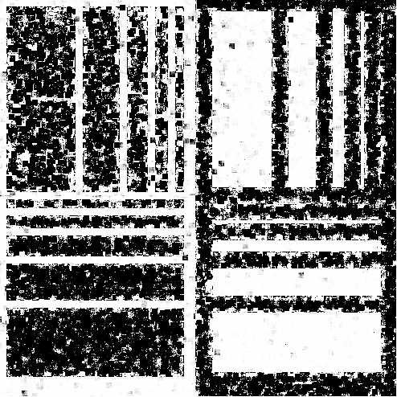
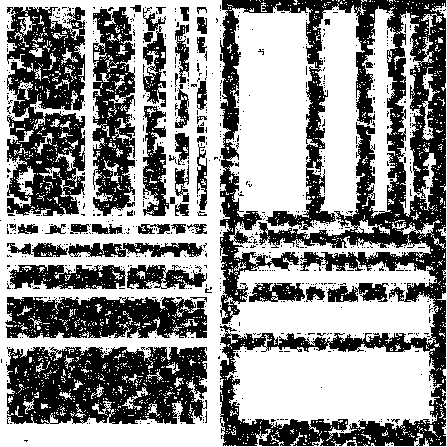

```{r setup, include=FALSE}
knitr::opts_chunk$set(cache=TRUE,
                      message=FALSE, warning=FALSE,
                      fig.path='figs/',
                      cache.path = '_cache/',
                      fig.process = function(x) {
                      x2 = sub('-\\d+([.][a-z]+)$', '\\1', x)
                      if (file.rename(x, x2)) x2 else x
                      })

library(ggplot2)
library(reshape2)
#library(plotly)
library(knitr)
library(pandoc)
library(gridExtra)
library(gtools)
library(stats4)
library(rmutil)
library(scales)
library(tidyr)
library(rmutil)
library(invgamma)
library(tidyverse)
library(RColorBrewer)
library(ggsci)
library(ggpubr)
library(patchwork)
library(dplyr)
#options(kableExtra.latex.load_packages = FALSE)
#library(devtools)
#devtools::install_github("haozhu233/kableExtra")
library(kableExtra)
library(ggthemes)
library(latex2exp)
library(e1071)# kurtosis
library(viridis)
library(nortest)# AD
library(minpack.lm)
library(univariateML)


theme_set(theme_minimal() +
            theme(text=element_text(family="serif"),
                  legend.position = "bottom")#  top , right , bottom , or left#, panel.grid = element_blank()
)

# if(!require("rstudioapi")) install("rstudioapi")
# setwd(dirname(rstudioapi::getActiveDocumentContext()$path))


source("../../../Code/R/MainFunctions/gamma_sar_sample.R")
source("../../../Code/R/MainFunctions/entropy_gamma_sar.R")
source("../../../Code/R/MainFunctions/entropy_gI0.R")
source("../../../Code/R/MainFunctions/gi0_sample.R")

source("../../../Code/R/MainFunctions/van_es_estimator.R")
source("../../../Code/R/MainFunctions/correa_estimator.R")
source("../../../Code/R/MainFunctions/bootstrap_correa_estimator_log_mean.R")
source("../../../Code/R/MainFunctions/ebrahimi_estimator.R")
source("../../../Code/R/MainFunctions/noughabi_arghami_estimator.R")
source("../../../Code/R/MainFunctions/vasicek_estimator.R")
source("../../../Code/R/MainFunctions/al_omari_1_estimator.R")
source("../../../Code/R/MainFunctions/al_omari_2_estimator.R")

source("../../../Code/R/MainFunctions/bootstrap_van_es_estimator.R")
source("../../../Code/R/MainFunctions/bootstrap_correa_estimator.R")
source("../../../Code/R/MainFunctions/bootstrap_ebrahimi_estimator.R")
source("../../../Code/R/MainFunctions/bootstrap_noughabi_arghami_estimator.R")
source("../../../Code/R/MainFunctions/bootstrap_vasicek_estimator.R")
source("../../../Code/R/MainFunctions/bootstrap_al_omari_1_estimator.R")
source("../../../Code/R/MainFunctions/bootstrap_al_omari_2_estimator.R")
#The next function contains the functions: generate_samples, calculate_bias_mse, generate_plot
source("../../../Code/R/Programs/functions_sample_bias_mse.R")# read_ENVI_images
source("../../../Code/R/Programs/read_ENVI_images.R")


```

# Introduction

Synthetic Aperture Radar (SAR) technology has become essential for environmental monitoring and disaster management. It provides valuable images under various conditions, including day or night and weather situations&nbsp;\cite{Moreira2013,Mu2019}.
However, the effective use of SAR data depends on a thorough understanding of its statistical properties because it is corrupted by speckle.
This noise-like interference effect is inherent in SAR data due to the coherent nature of the imaging process&nbsp;\cite{Argenti2013}.

Speckle in intensity format is non-Gaussian. Thus, SAR data require reliable statistical models for accurate processing. 
The $\mathcal{G}^0$ distribution, which is suitable for SAR data, includes the
Gamma law as the limiting case for fully-developed speckle&nbsp;\cite{Ferreira2020} and provides flexibility with fewer parameters for analysis.

Our work aims to improve the identification of potential roughness features in SAR intensity data.
Physical modeling of SAR data allows the use of the Gamma distribution in the presence of fully-developed speckle, where an infinite number of independent backscatterers per resolution unit is assumed, commonly referred to as homogeneous regions.

In this context, we present a set of three novel test statistics that aim to distinguish between homogeneous and non-homogeneous returns, particularly between gamma and \(\mathcal{G}^0\) distributed data, assuming the number of looks is known.


# Background {#sec:Background}

## Statistical Modeling of Intensity SAR data

The primary models for intensity SAR data include the Gamma and
$\mathcal{G}_I^0$ distributions [@Frery1997]. The first is suitable for
fully-developed speckle and is a limiting case of the second model. This
is interesting due to its versatility in accurately representing regions
with different roughness properties [@Cassetti2022]. We denote
$Z \sim \Gamma_{\text{SAR}}(L, \mu)$ and
$Z \sim \mathcal{G}_I^0(\alpha, \gamma, L)$ to indicate that $Z$ follows
the distributions characterized by the respective probability density
functions (pdfs): \begin{align}
    f_Z(z;L, \mu\mid \Gamma_{\text{SAR}})&=\frac{L^L}{\Gamma(L)\mu^L}z^{L-1}\exp\left\{-Lz/\mu\right\} \mathbbm 1_{\mathbbm R_+}(z)\label{E:gamma1}\\
    \intertext{ and }
    f_Z(z; \alpha, \gamma, L \mid \mathcal{G}_I^0)&=\frac{L^L\Gamma(L-\alpha)}{\gamma^{\alpha}\Gamma(-\alpha)\Gamma(L)}\cdot\frac{z^{L-1}}{(\gamma+Lz)^{L-\alpha}} \mathbbm 1_{\mathbbm R_+}(z),\label{E:gi01}
\end{align} where $\mu > 0$ is the mean, $\gamma > 0$ is the scale,
$\alpha < 0$ measures the roughness, $L \geq 1$ is the number of looks
(either nominal or estimated, thus not restricted to integer values),
$\Gamma(\cdot)$ is the gamma function, and $\mathbbm 1_{A}(z)$ is the
indicator function of the set $A$.

The $r$th order moments of the $\mathcal{G}_I^0$ model are
\begin{equation}
E\big(Z^r\mid \mathcal{G}_I^0\big)  = \left(\frac{\gamma}{L}\right)^r\frac{\Gamma(-\alpha-r)}{\Gamma(-\alpha)}\cdot\frac{\Gamma(L+r)}{\Gamma(L)}, 
    \label{E:rmom}
\end{equation} provided $\alpha <-r$, and infinite otherwise. Therefore,
assuming $\alpha<-1$, its expected value is \begin{equation}
    \mu=\left(\frac{\gamma}{L}\right)\frac{\Gamma(-\alpha-1)}{\Gamma(-\alpha)}\cdot\frac{\Gamma(L+1)}{\gamma(L)}=-\frac{\gamma}{\alpha+1}.
\end{equation}

Although the $\mathcal{G}_I^0$ distribution is defined by the parameters
$\alpha$ and $\gamma$, in the SAR literature \cite{Nascimento2010} the
texture $\alpha$ and the mean $\mu$ are usually used.
Reparametrizing \eqref{E:gi01} with $\mu$, and denoting this model as
$G_I^0$ we obtain: \begin{equation}
        f_Z\big(z; \mu, \alpha, L\mid G_I^0\big) = \frac{L^L\Gamma(L-\alpha)}{\big[-\mu(\alpha+1)\big]^{\alpha}\Gamma(-\alpha)\Gamma(L)} \frac{z^{L-1}}{\big[-\mu(\alpha+1)+Lz\big]^{L-\alpha}}.\label{E:gi02}
\end{equation}


# Simulations

To evaluate the relationship between the sample mean and the coefficient of variation (CV) across different levels of roughness, we simulated data from the $\mathcal{G}_I^0$ distribution for various values of the parameter $\alpha$ ($\alpha = -1.5, -3, -5, -10, -50, -1000$). For each $\alpha$, we generated multiple samples and plotted the CV versus the mean in subplots. These subplots collectively illustrate the transition from dependence to independence between the mean and CV as $\alpha$ decreases (becomes more negative). Specifically, at higher values of $\alpha$ (e.g., $\alpha = -1.5$), the scatter plots exhibit a logarithmic pattern, indicating a strong dependence characteristic of heterogeneous regions. As $\alpha$ approaches $-\infty$ (e.g., $\alpha = -1000$), the scatter plots display a random distribution of points, reflecting independence between the mean and CV, which is consistent with the behavior of the Gamma distribution and indicates homogeneity.


```{r Plot_empirical_gamma_and_gi0, echo=FALSE, message=FALSE, warning=FALSE, out.width="90%", fig.show="hold", fig.align="center", fig.pos="hbt", fig.cap="Scatter plot of CV versus Mean for for different $\\alpha$ values ."}

source("../../../Code/R/MainFunctions/gi0_sample.R")


sample.size <- 49
R <- 10000
mu <- 1
L <- 5

# Valores específicos de alpha
alphas <- c(-1.5, -3, -5, -10, -50, -1000)

results <- data.frame()

for (alpha in alphas) {
  means <- numeric(R)
  cvs <- numeric(R)
  
  for (r in 1:R) {
    z <- gi0_sample(mu, alpha, L, sample.size)
    means[r] <- mean(z)
    cvs[r] <- sd(z) / mean(z)
  }
  
  temp_data <- data.frame(Mean = means, CV = cvs, Alpha = factor(alpha))
  results <- rbind(results, temp_data)
}

# Crear el gráfico con facet_wrap
p <- ggplot(results, aes(x = Mean, y = CV)) +
  geom_point(alpha = 0.5, color = "#56B4E9", size = 0.5) +
  labs(title = "",#Scatter Plot of CV versus Mean for Different Alpha Values
       x = "Mean",
       y = "CV") +
  theme_minimal() +
  theme(
    plot.title = element_text(hjust = 0.5, size = 16),
    axis.title = element_text(size = 12),
    strip.text = element_text(size = 12),
    panel.grid.major = element_line(color = "gray80"),
    panel.grid.minor = element_line(color = "gray90")
  ) +
  facet_wrap(~ Alpha, ncol = 3, scales = "free")

# Mostrar el gráfico
print(p)

```


# Model Fitting

<!-- To model the dependency observed in the $G_I^0$ distribution, we used the following model: -->

<!-- $$ -->
<!-- \text{model}(\bar{x}) = \sqrt{n} \left(1 - \exp \left(- (\beta_0 + \beta_1 \bar{x})\right) \right) -->
<!-- $$ -->

<!-- where $\beta_0$ and $\beta_1$ are parameters, the p-value for $\beta_1$ plays a crucial role in understanding the fit of the model and the nature of the data distribution. -->

```{r Plot_gi02, echo=FALSE, message=FALSE, warning=FALSE, out.width="70%", fig.show="hold", fig.align="center", fig.pos="H", fig.cap="Scatter plot of CV versus Mean, $\\alpha=-1.5$."}

source("../../../Code/R/MainFunctions/gamma_sar_sample.R")
source("../../../Code/R/MainFunctions/entropy_gamma_sar.R")
source("../../../Code/R/MainFunctions/entropy_gI0.R")
source("../../../Code/R/MainFunctions/gi0_sample.R")
set.seed(1234567890, kind = "Mersenne-Twister")

# Parámetros de la simulación
sample.size <- 49
R <- 10000
mu <- 1
L <- 5
alpha1 <- -1.5

# Inicializar vectores para medias y coeficientes de variación
means <- numeric(R)
cvs <- numeric(R)

# Generar muestras y calcular medias y CVs
for (r in 1:R) {
  z <- gi0_sample(mu, alpha1, L, sample.size)
  means[r] <- mean(z)
  cvs[r] <- sd(z) / mean(z)
}

# Crear un dataframe
data <- data.frame(Mean = means, CV = cvs)

# Ajustar modelo con nlsLM para un ajuste robusto
nls_model_exp_simplified_lm <- nlsLM(CV ~ sqrt(sample.size) * (1 - exp(-(beta0 + beta1 * Mean)) - beta2),
                                     data = data, start = list(beta0 = 0.1, beta1 = 0.01, beta2 = 0.01))

# Resumen del modelo ajustado
#summary(nls_model_exp_simplified_lm)

# Añadir predicciones al dataframe
data$Fitted_CV_simplified_lm <- predict(nls_model_exp_simplified_lm)

# Graficar los datos y el modelo ajustado
ggplot(data, aes(x = Mean, y = CV)) +
  # Puntos de datos
  geom_point(alpha = 0.5, color = "red") +
  # Línea de predicción ajustada
  geom_line(aes(y = Fitted_CV_simplified_lm), color = "blue", size = 1) +
  # Etiquetas y título
  labs(title = paste("Scatter plot of CV versus Mean for gI0 distribution, alpha =", alpha1),
       x = "Mean",
       y = "Coefficient of Variation (CV)") +
  # Tema minimalista
  theme_minimal() +
  theme(
    plot.title = element_text(hjust = 0.5),
    panel.grid.major = element_line(color = "gray80"),
    panel.grid.minor = element_line(color = "gray90")
  )

# set.seed(1234567890, kind = "Mersenne-Twister")
# 
# sample.size <- 49
# R <- 10000
# mu <- 1
# L <- 5
# alpha1 <- -1.5
# means <- numeric(R)
# cvs <- numeric(R)
# 
# for (r in 1:R) {
#   z <- gi0_sample(mu, alpha1, L, sample.size)
#   means[r] <- mean(z)
#   cvs[r] <- sd(z) / mean(z)
# }
# 
# 
# data <- data.frame(Mean = means, CV = cvs)
# 
# # 
# start_values <- list(beta0 = 0.5, beta1 = 0.5)
# model <- nls(CV ~ sqrt(sample.size) * (1 - exp(-1.0*(beta0 + beta1 * Mean))), 
#              data = data, start = start_values)
# 
# # 
# #summary(model)
# 
# # 
# ggplot(data, aes(x = Mean, y = CV)) +
#   geom_point(alpha = 0.5, color = "red") +
#   stat_function(fun = function(x) sqrt(sample.size) * (1 - exp(-(coef(model)[1] + coef(model)[2] * x))),
#                 color = "blue", size = 1) +
#   labs(title = "Scatter plot of CV versus Mean for gI0 distribution",
#        x = "Mean",
#        y = "Coefficient of Variation (CV)") +
#   theme_minimal() +
#   theme(
#     plot.title = element_text(hjust = 0.5),
#     panel.grid.major = element_line(color = "gray80"),
#     panel.grid.minor = element_line(color = "gray90")
#   )

```


<!-- \section{Mathematical Justification of the Regression Model and Hypothesis Testing} -->

<!-- In this section, we provide a mathematical justification for fitting the regression model to our data using the likelihood function and formulating a hypothesis test. We use the following model to capture the relationship between the coefficient of variation (CV) and the sample mean $\bar{x}$. -->


We consider the regression model:

\begin{equation}
E(V_n\mid\bar{X}_n=\bar{x}_n) = \sqrt{n} \left(1 - \exp\left(- (\beta_0 + \beta_1 \bar{x}_n)\right) - \beta_2 \right),
\label{eq:model}
\end{equation}

where:
\begin{itemize}
    \item $\text{CV}$ is the sample coefficient of variation.
    \item $\bar{x}$ is the sample mean.
    \item $n$ is the sample size 
    \item $\beta_0$, $\beta_1$, and $\beta_2$ are parameters to be estimated.
\end{itemize}

This nonlinear model captures the relationship between $\text{CV}$ and $\bar{x}$, reflecting the behavior observed in the data, particularly when analyzing the dependence between these two statistics in SAR images.


\subsection{Hypothesis Testing for $\beta_1$}

Our goal is to test whether there is a significant dependence between the CV and the sample mean $\bar{x}$. Specifically, we test the null hypothesis:

\begin{equation}
H_0: \beta_1 = 0 \quad \text{(no dependence)},
\end{equation}

against the alternative hypothesis:

\begin{equation}
H_1: \beta_1 \neq 0 \quad \text{(dependence exists)}.
\end{equation}

\subsubsection{Test Statistic}

Under the assumption of normally distributed errors, the test statistic for $\beta_1$ is:

\begin{equation}
t = \frac{\hat{\beta}_1}{\text{SE}(\hat{\beta}_1)},
\end{equation}

where $\text{SE}(\hat{\beta}_1)$ is the standard error of $\hat{\beta}_1$. This statistic follows a $t$-distribution with $B - p$ degrees of freedom, where $p$ is the number of parameters estimated (here, $p = 2$).

\subsubsection{P-value Calculation}

The p-value is calculated as:

\begin{equation}
p\text{-value} = 2 \times P(T > |t|),
\end{equation}

where $T$ follows a $t$-distribution with $B - 2$ degrees of freedom.

<!-- \subsection{Interpretation of the Test} -->

<!-- \begin{itemize} -->
<!--     \item \textbf{If the p-value is less than the significance level $\alpha$ (e.g., $0.05$):} -->
<!--     \begin{itemize} -->
<!--         \item We reject the null hypothesis $H_0$. -->
<!--         \item Conclude that $\beta_1$ is significantly different from zero. -->
<!--         \item There is evidence of dependence between CV and $\bar{x}$. -->
<!--         \item The data is better modeled by the $\mathcal{G}_I^0$ distribution, indicating heterogeneity. -->
<!--     \end{itemize} -->
<!--     \item \textbf{If the p-value is greater than $\alpha$:} -->
<!--     \begin{itemize} -->
<!--         \item We fail to reject the null hypothesis $H_0$. -->
<!--         \item Conclude that there is no significant evidence of dependence. -->
<!--         \item The data can be modeled by the Gamma distribution, indicating homogeneity. -->
<!--     \end{itemize} -->
<!-- \end{itemize} -->

<!-- \subsection{Application to Sliding Windows in SAR Images} -->

<!-- Due to the limited sample size in each sliding window (e.g., $n = 7 \times 7 = 49$ pixels), we employ bootstrapping to generate multiple pairs $(\bar{x}_i, \text{CV}_i)$ within each window. -->

<!-- \subsubsection{Bootstrapping Procedure} -->

<!-- \begin{enumerate} -->
<!--     \item For each window, resample the data with replacement $B$ times. -->
<!--     \item For each resampled dataset, compute $\bar{x}_i$ and $\text{CV}_i$. -->
<!--     \item Collect the $B$ pairs $(\bar{x}_i, \text{CV}_i)$ for regression analysis. -->
<!-- \end{enumerate} -->

<!-- This approach allows us to estimate the distribution of the estimators and their standard errors, increasing the reliability of our statistical inferences. -->

\subsection{Results and Visualization}

By applying the above methodology to each sliding window in the SAR image, we obtain a matrix of p-values corresponding to the estimated $\beta_1$ in each window.

\begin{itemize}
    \item Regions with low $p$-values (e.g., $p < 0.05$) indicate significant dependence, suggesting heterogeneity.
    \item Regions with high $p$-values indicate no significant dependence, suggesting homogeneity.
\end{itemize}

These results can be visualized by mapping the p-values across the image, highlighting areas of heterogeneity and homogeneity.

# Results 

This section presents the simulations we performed to evaluate the proposed test statistics' performance, followed by applications to SAR data.

## Simulated Data
```{r sim_Phantom, echo=FALSE, message=FALSE, warning=FALSE, fig.fullwidth = TRUE, out.width="100%",fig.pos = 'H', fig.cap='Synthetic dataset: (\\textbf{a}) Phantom. (\\textbf{b}) Simulated image, varying $\\alpha$ and $\\mu$, with $L=5$. ',  fig.subcap=c('', ''), out.width = c( "60mm","80mm"),  fig.ncol=2, fig.width = 30, fig.height = 20}

knitr::include_graphics("./figs/Phantom_labels.pdf")
```

```{r real_SAR_Images_coe, echo=FALSE, message=FALSE, warning=FALSE, fig.fullwidth = TRUE, out.width="100%",fig.align="center",fig.pos = 'H', fig.cap='Results for a threshold of $0.05$ of the $p$-value.',  fig.subcap=c(' ', ' ',' '), out.width = c("55mm","55mm"),  fig.ncol=2, fig.width = 30, fig.height = 20,fig.hspace=1.5}



#knitr::include_graphics("./figs/H_005_Phantom_4_z1_AO_200b.png")

```


```{=html}
<!--
# References
\setlength{\parindent}{-0.2in}
\setlength{\leftskip}{0.2in}
\setlength{\parskip}{8pt}
\vspace*{-0.2in}
\noindent
-->
```
